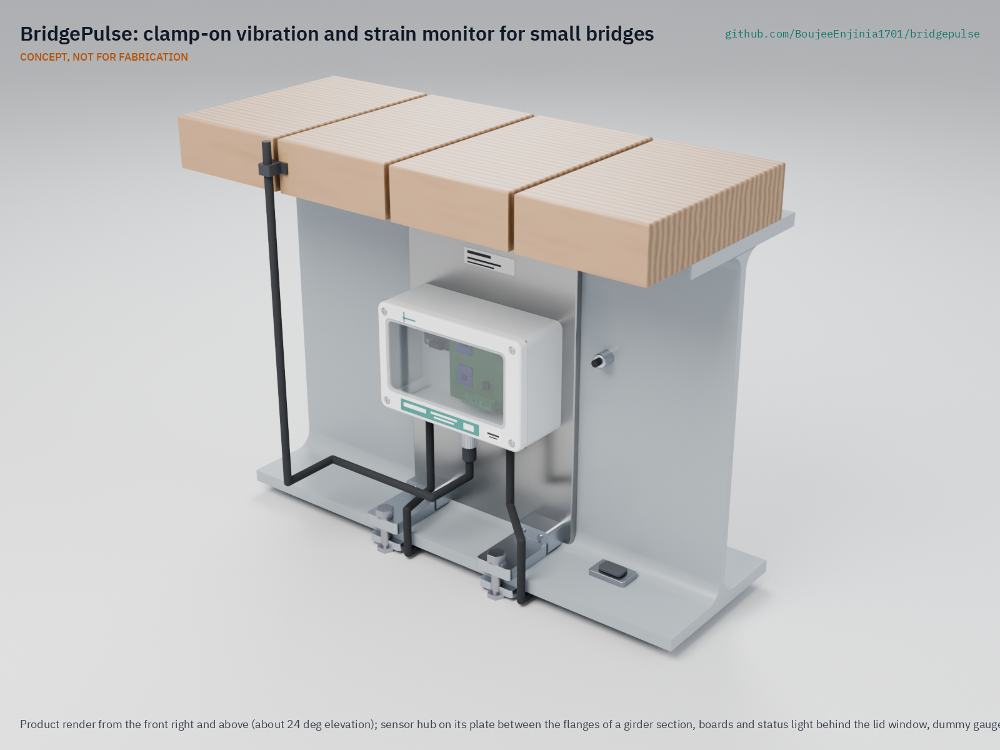

# BridgePulse

  

**Area:** Smart Cities · **TRL:** 3 of 9 (proof of concept on paper) · **Prototype budget:** $250 USD for the BridgePulse-specific parts · **Difficulty:** 3 of 5

A vibration and strain monitor for small bridges and footbridges that tracks natural frequency and strain over time to flag changes that need inspection.

[Exploded render](media/render-exploded.png) · [Detail render](media/render-detail.png) · [Interactive 3D model](media/viewer.html) · [Concept blueprint (PDF)](media/concept-blueprint.pdf) · [General arrangement BRP-DWG-001 (PDF)](cad/drawings/BRP-DWG-001.pdf) · [Calculations BRP-CAL-001](docs/04-calcs/01-sizing.md) · [Review note](docs/REVIEW.md)

## Concept rationale

A bridge's natural frequencies depend on its stiffness, so a loss of stiffness from corrosion, cracking or a failing bearing shows up as a small, lasting drop in frequency, and a change in how load is carried shows up in strain. The difficulty is that temperature moves the frequencies too. The Z24 bridge study showed that a model of frequency against temperature, learned from the healthy bridge, can separate the two ([Peeters and De Roeck, 2001](https://doi.org/10.1002/1096-9845%28200102%2930:2%3C149::AID-EQE1%3E3.0.CO;2-Z)). BridgePulse applies that idea with one clamp-on sensor hub at midspan, hourly 10 minute records and a learned temperature band, so the owner's engineer gets a reason to inspect sooner rather than a stream of raw data.

It is open and garage-buildable because the owners of small bridges, such as towns, counties, park services and rural access programs, are the ones least able to pay for commercial monitoring. Low-noise MEMS accelerometers now cost tens of dollars, the hub clamps on without drilling, and power, radio and data handling come from the lab's shared FieldNode, TwinKit and CityTwin projects. Open design files and open methods also let engineers check how a flag was raised, which matters more than the hardware.

## Burning platform

Bridge stock is large, aging and inspected at long intervals. In the United States, 41,685 of 624,193 bridges (6.7 %) were in poor condition in 2025 ([FHWA](https://www.fhwa.dot.gov/bridge/nbi/no10/condition25.cfm)), and routine inspections may be 24, 48 or, under a risk-based method, up to 72 months apart ([23 CFR 650.311](https://www.ecfr.gov/current/title-23/chapter-I/subchapter-G/part-650/subpart-C/section-650.311)). In Japan, about 37 % of roughly 730,000 road bridges were 50 years old or more in 2023, rising to about 54 % by 2030 ([MLIT](https://www.mlit.go.jp/sogoseisaku/maintenance/02research/02_01.html)).

Findings also have to reach someone who acts. The Fern Hollow Bridge in Pittsburgh collapsed in January 2022 after the city failed to act on repeated maintenance recommendations in its inspection reports ([NTSB](https://www.ntsb.gov/investigations/Pages/HWY22MH003.aspx)). A monitor cannot replace inspection or funding, but a clear, early signal on a specific bridge can help put limited inspection time where it is needed.

## Where it could be used

### By industry

| Industry | Use |
| --- | --- |
| Municipal and county public works | Watching footbridges and short road bridges between routine inspections, and after floods or vehicle strikes |
| Parks, trails and recreation | Timber and steel trail bridges that see few inspections and many visitors |
| Rural access and humanitarian programs | Checking a sample of trail bridges built years earlier without a site visit to each one |
| Rail and transit operators | Station footbridges and pedestrian overbridges |
| Forestry and mining | Haul road and forestry bridges carrying heavy, irregular loads |
| Universities and training | An open platform for teaching and research in vibration-based structural health monitoring |

### By country or region

| Country or region | Why it matters there |
| --- | --- |
| United States | 41,685 bridges were rated poor in 2025 ([FHWA](https://www.fhwa.dot.gov/bridge/nbi/no10/condition25.cfm)); many are small, locally owned structures. |
| Great Britain | 2,928 council-maintained road bridges were substandard in 2023, with a £6.8 billion backlog; councils also report growing concern about flooding and scour ([RAC Foundation](https://www.racfoundation.org/media-centre/changing-weather-patterns-worrying-bridge-engineer)). |
| Japan | The share of road bridges 50 years old or more is set to rise from about 37 % to about 54 % between 2023 and 2030 ([MLIT](https://www.mlit.go.jp/sogoseisaku/maintenance/02research/02_01.html)). |
| Nicaragua and Central America | Floods cut labor income by about 18 % in villages without a footbridge, and new bridges removed that loss ([Brooks and Donovan, 2020](https://doi.org/10.3982/ECTA15828)); keeping existing footbridges in service protects that gain. |
| Rwanda and East Africa | Trail bridge programs report a preliminary annual return of about 49 % on trail bridges in Rwanda and similar settings ([Fika, formerly Bridges to Prosperity](https://fika.org/measuring-roi-for-trail-bridges/)), so a growing stock of footbridges will need low-cost ways to check them. |

## What sparked the idea

The idea traces back to the Silver Bridge between Point Pleasant, West Virginia, and Ohio, which fell on December 15, 1967, killing 46 people, after a single eyebar in a suspension chain fractured from a defect only 2.5 mm (0.1 in) deep. The disaster led to the National Bridge Inspection Standards of April 27, 1971, which set inspections at least once every two years by trained inspectors ([FHWA](https://highways.dot.gov/highway-history/general-highway-history/happy-50th-anniversary-national-bridge-inspection-standards)). That calendar-based regime is still the backbone of bridge safety, but it leaves long gaps in which nobody watches a structure, and it is weakest for the small footbridges and local spans that get the least attention. BridgePulse starts from that gap: a low-cost record of how a small bridge behaves between inspections, fed to the owner's engineer and to CityTwin, so that a change can prompt a visit sooner than the calendar would.

## Problem

Many small bridges are inspected rarely, and deterioration is found late. Their owners seldom have the budget for commercial monitoring, so there is no record of how a bridge behaves between inspections. See the [problem statement](docs/01-problem.md).

## Concept

A vibration and strain monitor for small bridges and footbridges that tracks natural frequency and strain over time to flag changes that need inspection. A sensor hub fixed between the flanges of a girder at midspan records 10 minutes of acceleration, strain and temperature every hour, extracts the natural frequencies and strain statistics on board, and sends about 36 bytes per hour (11 bytes where the radio data rate allows no more) through a FieldNode core over LoRaWAN to TwinKit or CityTwin. A temperature-compensated baseline, learned over weeks, flags lasting changes to the owner's engineer.

The TRL 3 calculations ([BRP-CAL-001](docs/04-calcs/01-sizing.md)) give 16.9 mW average draw, 0.0153 Hz spectral resolution per record, 1.39 GB of raw records per month kept on site, and $248 of BridgePulse-specific parts ($374 with the FieldNode core, which is costed in its own repo). On the 7 m example footbridge the first mode is 23.9 Hz and the instrument can track it to about 0.05 % an hour, but the mass of people crossing lowers it by up to 6 %. The hub therefore gates out the time when someone is on the span; in simulation that brings the hourly scatter to 0.015 % or less, inside the 0.2 % target, which remains at risk until recorded data confirm it. The 1 % change detection cannot be verified on paper. See the [requirements](docs/03-requirements.md) for what is and is not met.

Full design precis: [docs/02-concept.md](docs/02-concept.md)

## Key components

- Sensor hub: IP67 die-cast aluminium enclosure on an aluminium plate jacked between the girder flanges, no drilling
- Low-noise 3-axis MEMS accelerometer (ADXL355 class)
- Signal board with 24-bit bridge ADC, RP2040 class microcontroller, RS-485 link and industrial microSD card
- Two strain gauge half-bridges with temperature-compensating dummy gauges
- Two TMP1826 class temperature probes in stainless sheaths (steel and air)
- Shielded sensor cables with M12 connectors
- FieldNode core (shared lab component): 6 W panel, LiFePO4 cell, MPPT charger and LoRaWAN radio

The working bill of materials is in [bom/bom.csv](bom/bom.csv).

## Safety

> A research prototype; it supports but never replaces inspection by qualified engineers, and a "no change" result never means a bridge is safe. Install only with the asset owner's permission, by trained crews, with fall protection, a rescue plan for work over water and traffic management as local rules require. Test old paint for lead before removing any for strain gauges. The FieldNode core contains a lithium iron phosphate cell; use its protected, fused pack. Nothing is drilled or welded into the structure, and every clamped part carries a secondary lanyard.

## Repository layout

| Folder | Contents |
| --- | --- |
| `docs/` | Problem, concept, requirements, calculations and design decisions |
| `cad/src/` | build123d Python source, the source of truth for all geometry |
| `cad/step/`, `cad/stl/` | Exported models for FreeCAD, other CAD tools and printing |
| `cad/drawings/` | 2D sketches and dimensioned drawings |
| `bom/` | Bill of materials |
| `electronics/` | KiCad schematics and PCB layouts |
| `firmware/` | Microcontroller code |
| `media/` | Renders, perspectives and photos |
| `build-log/` | Dated prototyping notes |

## Documentation

Controlled documents follow the portfolio [documentation standard](.kit/STANDARDS.md). Each carries a document ID (BRP-PRC-001 for the precis), a version and a revision history. Branded PDFs are built with `python .kit/render.py` and attached to GitHub Releases when a document is tagged, for example `BRP-PRC-001/v1.0`.

## Credits

Designed by Amish Chadha. See [CONTRIBUTORS.md](CONTRIBUTORS.md) for roles. To cite this design, use [CITATION.cff](CITATION.cff) (GitHub shows it as "Cite this repository").

AI assistance (Claude) was used to accelerate concept renders, prototype documentation and first-pass sizing calculations. Design direction and all decisions are Amish Chadha's, recorded in this repository's decision records (`docs/decisions/`).

## Licenses

- **Hardware** (CAD, drawings, BOM, electronics): [CERN-OHL-S v2](LICENSE)
- **Software** (firmware, scripts, notebooks): [MIT](LICENSE-SOFTWARE)

A project of the [Design Molecule](https://designmolecule.com) lab.
