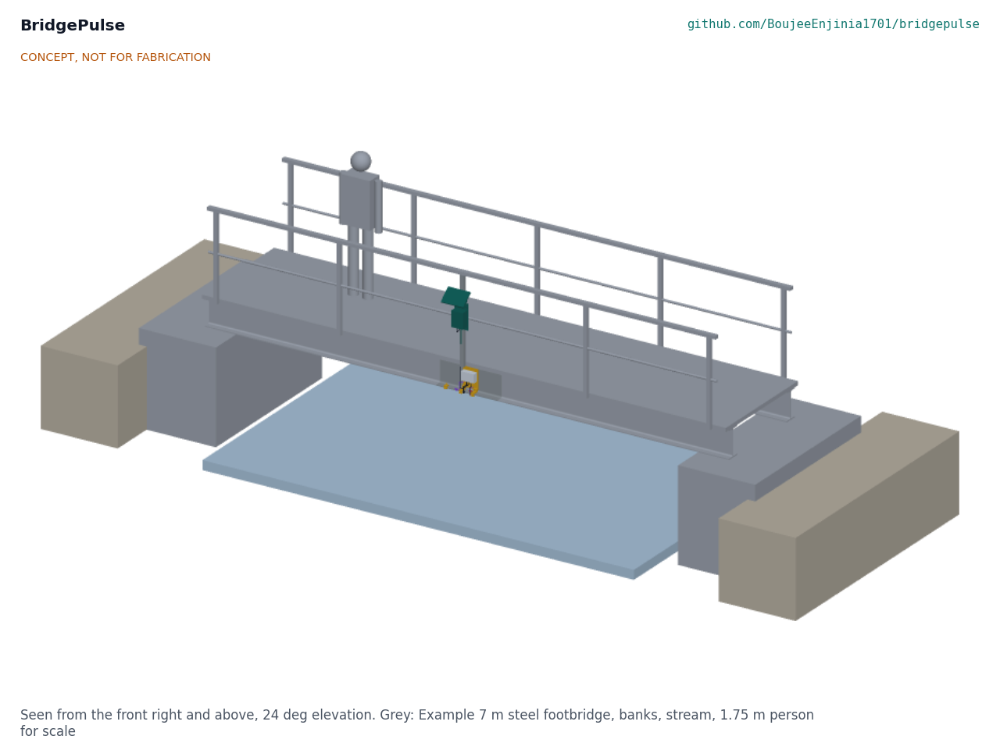
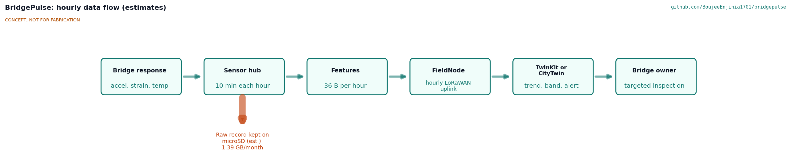
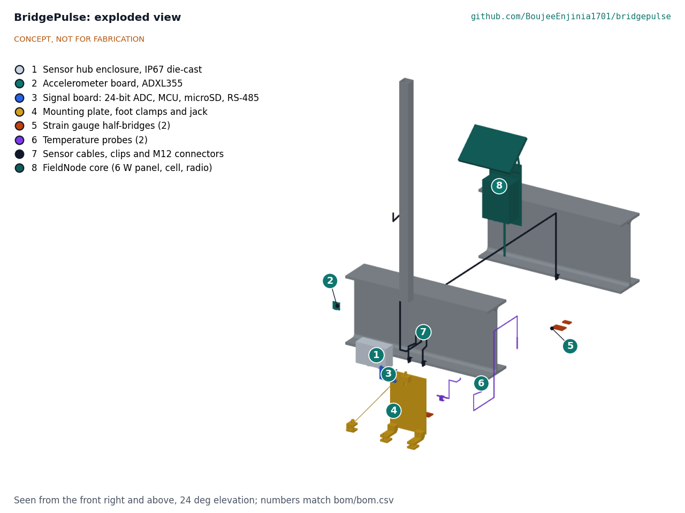
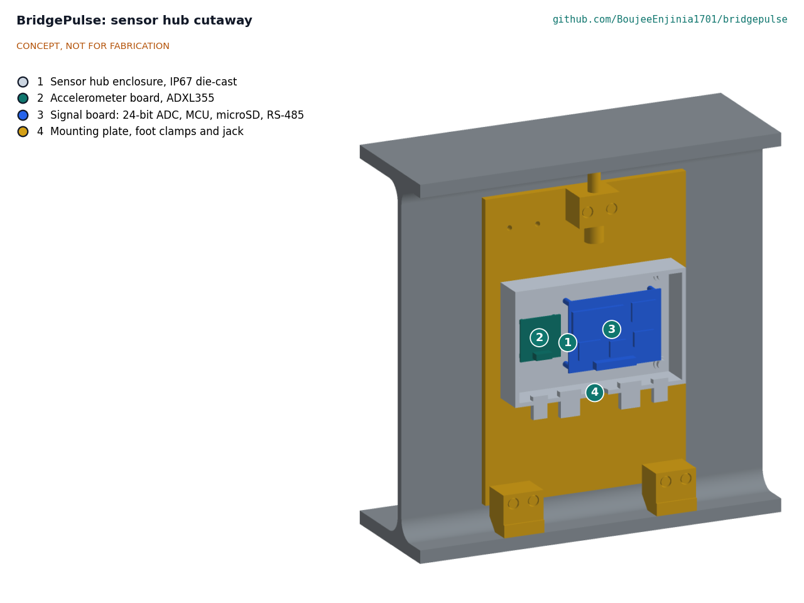

# BridgePulse design precis

## Summary

BridgePulse is a clamp-on monitor for small bridges and footbridges. A sensor hub fixed to a girder at midspan records ambient vibration, strain and temperature for 10 minutes every hour, works out the bridge's natural frequencies and strain statistics on board, and sends a short summary through a FieldNode core over LoRaWAN to TwinKit or CityTwin. Over weeks the system learns how the frequencies move with temperature; a sustained shift outside that band is flagged to the bridge owner's engineer as a reason to inspect sooner. It is a research prototype that supports inspection, never a safety rating.

The TRL 3 calculations (BRP-CAL-001) give 16.9 mW average draw at the FieldNode port, a 36-byte hourly uplink, 1.39 GB per month of raw records kept on a microSD card (22 months on 32 GB), and $275 of BridgePulse-specific parts ($401 with the FieldNode core), $25 over the $250 value-engineering target since the parts that make the design buildable, the lanyard anchor and the installation banding were added (see the value engineering section of BRP-DEC-001). On the 7 m example footbridge the first mode is 23.9 Hz and the instrument can track it to 0.05 % an hour, but walkers' own mass lowers it by up to 6 % while they cross. The hub therefore gates out the time when someone is on the span; in simulation this brings the hourly scatter to 0.015 % or less (R2 at risk until recorded data confirm it; R3 not verifiable at TRL 3).

*Figure 1. Concept render. The monitor clusters at midspan: sensor hub between the flanges of the south girder, FieldNode core on the handrail post. Grey parts are the existing bridge and a 1.75 m person for scale.*

## How it works

1. **Sense.** A low-noise 3-axis MEMS accelerometer, fixed inside the hub to the enclosure base, picks up the bridge's response to wind, footfall and traffic. The hub is screwed to an aluminium plate that lies against the web, stands on two foot blocks clamped to the bottom flange and is wedged against the top flange by a jack screw, so that its own mounting resonance (135 to 271 Hz) is well above the measured band. A stainless wire lanyard from a pad eye on the plate to a second, independent girder clamp on the bottom flange holds everything if the mount ever lets go. Two strain gauge half-bridges under the bottom flanges of both girders at midspan measure bending strain. Two temperature probes measure the steel and the shaded air under the deck.
2. **Record.** Once an hour the FieldNode core switches on the 5 V rail of its sensor port. The hub boots, warms the gauges for 20 s and samples for 600 s: acceleration at 250 Hz on three axes, strain at 20 Hz on two channels, temperature once a minute. The raw record goes to an industrial microSD card so an engineer can download it later.
3. **Reduce.** The hub first finds each crossing from the strain step and gates out that stretch of the record, with 0.25 s either side and tapered edges, so that the frequency is estimated only while nobody's mass is on the span (BRP-DDR-002). It then reads the record back from the card one axis at a time, computes averaged spectra (Welch method, 65.5 s Hann segments with 50 % overlap), and estimates the frequencies of the first modes below 60 Hz by fitting a single-degree-of-freedom spectrum around each peak. A fit is accepted only if the peak stands 10 dB above the fitted noise and the damping is plausible; otherwise the hour is sent as "no clear peak", never as a shift. It also computes peak amplitudes, RMS acceleration, and the strain minimum, maximum and mean on each channel.
4. **Send.** The 36-byte summary passes over RS-485 on the M12 cable to the FieldNode core, which sends it as one LoRaWAN uplink; the rail is then switched off until the next hour. Where the data rate in use allows only 11 bytes (US915 DR0, AS923 DR2 with dwell time), the hub sends an 11-byte reduced summary instead: first frequency, its amplitude, the two strain means, steel temperature and a status byte with the gated seconds (BRP-CAL-001, G).
5. **Learn and flag.** TwinKit stores the series and fits frequency against steel temperature over a baseline period, following the approach of the Z24 bridge study ([Peeters and De Roeck, 2001](https://doi.org/10.1002/1096-9845%28200102%2930:2%3C149::AID-EQE1%3E3.0.CO;2-Z)). A frequency that stays outside the confidence band for a set period, or a step in the strain baseline, raises a flag to the owner's engineer. As a second line against any load effect the gate misses, TwinKit also regresses each hourly frequency on a load indicator (strain mean, RMS acceleration) sent in the summary. TwinKit can show the measured frequency next to the value calculated from the bridge model.
6. **Act.** The engineer decides whether to inspect. The public CityTwin view shows only that the bridge is monitored and when data last arrived.

*Figure 2. Hourly data flow. Values are estimates from BRP-CAL-001.*

## Main components

Numbers match the exploded view (Figure 3) and `bom/bom.csv`. The general arrangement is drawing BRP-DWG-001.

| No. | Component | Role |
| --- | --- | --- |
| 1 | Sensor hub enclosure, die-cast aluminium, IP67, 170 × 64 × 110 mm | Stiff, sealed housing whose base is screwed flat to the plate, coupling the accelerometer to it; two M16 gauge glands, two M12 probe glands and an M12 panel connector underneath |
| 2 | Accelerometer board, ADXL355 class | 3-axis, 22.5 µg/√Hz noise density, 200 µA in measurement mode ([Analog Devices](https://www.analog.com/en/products/adxl355.html)) |
| 3 | Signal board: 24-bit bridge ADC (ADS1220 class), RP2040 class microcontroller, 5 V to 3.3 V buck converter, RS-485 transceiver, microSD socket, gauge excitation switch | Sampling, spectra, features, raw storage, link to FieldNode |
| 4 | Mounting plate, 200 × 291 × 8 mm 6061 aluminium, on two foot blocks clamped to the bottom flange tip by steel jaws, with an M12 jack screw to the top flange | Holds the hub between the flanges, inside the girder outline, clear of the root fillets; no drilling |
| 5 | Strain gauge half-bridges (2): each an active 350 Ω foil gauge on the flange plus a dummy gauge on an unstrained coupon of the same steel, with protective coating and cover | Bending strain at midspan of each girder, temperature-compensated |
| 6 | Temperature probes (2), TMP1826 class 1-Wire sensor potted in a stainless sheath, ±0.3 °C from −40 to +105 °C ([Texas Instruments](https://www.ti.com/product/TMP1826)) | Steel and shaded air temperature for frequency compensation |
| 7 | Sensor cables and M12 connectors | Gauges to hub, hub to FieldNode |
| 8 | FieldNode core: IP65 enclosure, 6 W panel as sun hood, LiFePO4 cell, MPPT charger, LoRaWAN radio, pole clamps | Power, radio and mounting shared across the lab's outdoor projects |
| 9 | microSD card, industrial grade, 32 GB | Raw records on site (in item 3; not shown separately) |

*Figure 3. Exploded view with BOM numbers. The girder and post are existing structure.*

*Figure 4. Cutaway of the sensor hub on its plate, between the flanges of the south girder. The accelerometer board is fixed to the base of the enclosure on the plate side so it moves with the girder.*

## Key numbers (BRP-CAL-001)

All values come from BRP-CAL-001 v0.3, which states its assumptions; they are calculations, not measurements.

### Example bridge

- 6.4 m between bearings; two IPE 360 class girders; EI = 6.52 × 10⁷ N·m²; 167 kg/m. First vertical mode **23.9 Hz**, second 96 Hz (outside the band); modal mass 535 kg.
- A lasting 1 % drop in frequency is a 2 % loss of bending stiffness. The steel modulus alone moves the frequency by about 1 % between −20 and +50 °C, so temperature compensation is needed.
- **People change the frequency of a light footbridge.** One 75 kg walker at midspan lowers f₁ by 6.3 %; a crowd of one person per square meter lowers it by 22.7 %. On a road bridge with 20 t of modal mass one walker moves it by 0.19 %.

### Measurement

- Bin width 0.0153 Hz; 17 averaged segments per record; sensor noise 2.8 µg in one bin. The mode's 0.48 Hz half-power bandwidth, not the bin width, limits precision.
- Simulated scatter of the hourly estimate from sensor noise: 0.053 % at 100 µg RMS of modal response with a curve fit, against 0.265 % with simple peak picking; a clear peak needs about 30 µg RMS. One walker gives about 29 mg RMS near midspan, so footfall is ample excitation.
- Because the walkers who excite the bridge also load it, an estimate over the whole record is biased by about −5 % and scatters by 1.5 to 3.1 % in a time-varying simulation. With load gating the bias is −0.03 to −0.04 % and the scatter 0.015 % or less (1 to 20 crossings in the record), inside R2's 0.2 %; 4.4 % of the record is gated out at 5 crossings. With one crossing on a quiet day, 20 % of records give no clear peak.
- Detecting a 1 % shift within 14 days with one false flag per year needs a daily residual of 0.75 % or less after temperature and load compensation.
- Strain: 1.65 µV per µε; 0.09 µε RMS resolution at the assumed ADC noise; a 5 kN/m² crowd gives 106 µε and one walker 3.2 µε, so strain is a usable load indicator.

### Power, data and mounting

| Quantity | Value |
| --- | --- |
| Power while recording, at the FieldNode port | 92.9 mW |
| Average, with the rail off between records | **16.9 mW** (0.41 Wh per day; 17 % of FieldNode's 100 mW allowance) |
| Raw data | 1.90 MB per hour; 1.39 GB per month; 22 months on 32 GB |
| Uplink | 36 bytes hourly, 329 ms at SF9; 11-byte reduced summary where the data rate allows only 11 bytes, 371 ms at SF10 |
| Mass on the girder | 3.58 kg (hub 0.99 kg, plate 1.25 kg, foot clamps, jack and fixings 0.97 kg, lanyard girder clamp, pad eye and wire 0.37 kg); FieldNode core 2.41 kg |
| Mounting resonance of the hub | 135 to 271 Hz (TRL 2 arrangement about 75 Hz) |
| Lanyard | Peak 1.20 kN if the mount lets go with 25 mm of slack (dynamic factor 38); girder clamp rated 100 kg or more working load |
| Depth below the soffit | 10 mm at most (limit 15 mm) |

### Cost

Value-engineering target $250 (a hypothetical control target, not a limit), which under BRP-DDR-001 D1 covers the BridgePulse-specific parts. Estimated cost of the constructable design: $275.00 ($25.00 over the target); with the FieldNode core ($126.00, costed in its own repo) the complete monitor is $401.00. The TMP1826 class probes added $4.00, the parts that make the design buildable (BRP-DDR-004) $4.00, the lanyard anchor decided on 2026-10-02 $19.00 and the stainless banding for installed units $4.00. Savings worth trying are listed in the value engineering section of the design decisions register (BRP-DEC-001). The bridge, installation labor, access equipment, traffic management and paint testing are not included.

## Key design choices

Each is decided by Amish, 2026-09-25: go with recommendation (BRP-DDR-001, BRP-DDR-002).

1. **Ambient vibration only.** No shaker or impact hammer; wind, footfall and traffic excite the bridge. Footfall is ample on a used footbridge; very quiet bridges remain a risk.
2. **Separate hub on the girder, FieldNode on a post.** The accelerometer must be on the structure, while the panel needs sun and the radio a clear view.
3. **Hourly 10 minute windows rather than continuous recording.** 16.9 mW against about 93 mW, with 24 frequency estimates a day.
4. **Temperature-compensated trend, not fixed limits.** A frequency band learned from the bridge's own baseline, with at least four weeks of data before any flag and a full year to cover seasons. BRP-CAL-001 shows it must model load on the deck as well as temperature.
5. **Foil gauge half-bridges with a dummy on a coupon.** Cheaper and easier to fit than weldable or vibrating-wire gauges, at the cost of long-term drift, to be checked early.
6. **One accelerometer at midspan.** Enough for the first vertical and torsional modes.
7. **Built on FieldNode, TwinKit and CityTwin.** The hub connects to one FieldNode M12 5-pin port, using its switched rail at 5 V and RS-485 on two signal pins. This follows FieldNode's candidate pinout, adopted on 2026-10-02 as the shared standard with Modbus RTU as the protocol (pin 1 switched 5 V rail, pins 2 and 4 RS-485 A and B, pin 3 ground, pin 5 analog); FieldNode is asked to record it as decided (BRP-DEC-001).
8. **Engineer-only alerts.** Flags go to the owner's engineer; the public CityTwin view shows only monitoring status.
9. **An RP2040 class microcontroller in the hub,** which post-processes each record from the card because the three axes do not fit in its RAM at once.
10. **Load gating, backed by a load regression.** The hub gates out the time when people are on the span; TwinKit regresses what remains on a load indicator. R2 stays at 0.2 % until recorded data show whether this works (BRP-DDR-002).
11. **An 11-byte reduced summary** wherever the data rate in use limits the payload to 11 bytes (BRP-DDR-002).
12. **TMP1826 class probes with an ice-point check,** so the ±0.5 °C of R5 holds down to −20 °C (BRP-DDR-002).

## Safety

> **Safety:** BridgePulse is a research prototype. It supports but never replaces inspection by qualified engineers, and a "no change" result never means a bridge is safe. Owners must not defer or skip inspections because a monitor is fitted.

> **Safety:** Installation is work at height, often over water or traffic. Install only with the owner's written permission, with trained crews, fall protection, a rescue plan for work over water, and traffic management as local rules require. Never work alone.

> **Safety:** Old steel bridges may be coated with lead or other hazardous paint. Test before removing any paint for strain gauges; if lead is present, use a trained contractor and local abatement rules. Gauge adhesives and coatings are chemicals: follow their safety data sheets, use gloves and eye protection and ventilate.

> **Safety:** The FieldNode core contains a lithium iron phosphate cell. Use the fused, protected pack and cold-charge lockout specified by FieldNode and never mount a damaged pack.

> **Safety:** Nothing may be drilled, welded or cut into the structure. The jack screw preload and the clamps must be checked so they cannot loosen and fall onto people, vehicles or boats below; use a secondary 3 mm stainless wire lanyard from the pad eye on the plate to a second, independent load-rated girder clamp on the bottom flange, at least 150 mm along the span from the foot clamps, fitted with no more than 25 mm of slack. Isolate the aluminium plate from the steel so galvanic corrosion cannot loosen it over time.

> **Safety:** Fit tamper-resistant fasteners on the post-mounted FieldNode so the public cannot pull it off or hang from it: stainless banding with a one-way crimped buckle on installed units (worm-drive bands only on the bench). Keep cables out of reach from the deck.

## Open questions

- [ ] 1. Does load gating hold on recorded footfall, with real walkers, several modes and wind, as it does in simulation? (BRP-CAL-001, B; TRL 4, on hold)
- [ ] 2. How much do frequencies move with temperature on small steel, concrete and timber bridges, and can a model trained on four weeks of data hold across seasons to a daily residual of 0.75 %?
- [ ] 3. What drift do foil strain gauges show outdoors over a year with the proposed coating?
- [x] 4. Which FieldNode port pinout and protocol will be agreed (BRP-DDR-001, O1)? Decided 2026-10-02: FieldNode's candidate pinout with Modbus RTU over RS-485, as the shared standard.
- [ ] 5. What is the alert rule (size of shift, duration) and who receives it?
- [ ] 6. Does the potted TMP1826 class probe hold its datasheet accuracy after sealing, at the ice point and in CalRig? (TRL 4, on hold)
- [x] 7. Who owns the data, and what is published openly through CityTwin (BRP-DDR-001, O3)? Decided 2026-10-02: the bridge owner owns all data; only monitoring status is published, and research datasets only with the owner's written consent, under an open licence such as CC BY 4.0.
