# BridgePulse prototype build plan

**Plan, not yet built.** How to build the first proof-of-concept prototype, component by component. Building and testing to it is TRL 4 work. Decisions still to be made are kept in the design decisions register ([docs/06-design-decisions.md](06-design-decisions.md)), not here.

## 1. What you are building

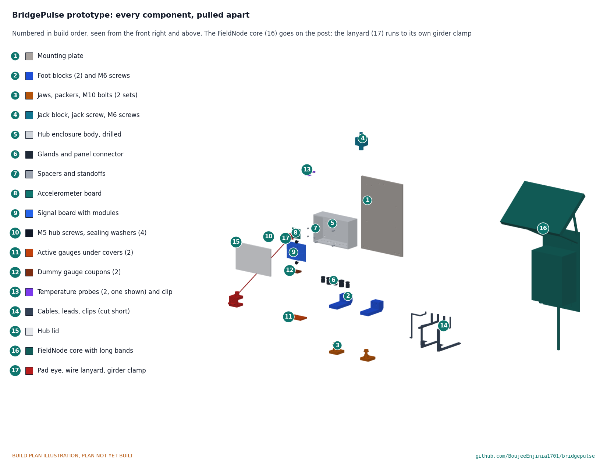

*Figure 1. Every component pulled apart and numbered in build order. The FieldNode core (16) is drawn beside the hub; it goes on the handrail post.*

The prototype is one BridgePulse monitor fitted to a bench rig that stands in for the middle of the example footbridge: two short offcuts of the girder section, 1.2 m apart, and a stub of the 50 mm square handrail post. At its heart is a sealed die-cast box, the sensor hub, holding an accelerometer board and a signal board. The hub is screwed to an aluminium plate that lies against the girder's web between its flanges, stands on two foot blocks clamped to the bottom flange and is wedged against the top flange by a jack screw, so nothing is drilled into the bridge. A strain gauge under each girder, a dummy gauge on a loose steel coupon beside each, and two temperature probes complete the sensors; cables run to the hub on push-on flange clips, and one cable takes power and data to a FieldNode core on the post. Figure 1 shows the 16 components in the order you make or fit them. Seven are made in a small workshop: the mounting plate, the foot blocks, the clamp jaws and packers, the jack block, the drilled hub box, the dummy gauge coupons and the temperature probes. Everything else is bought, or in the case of the FieldNode core built to its own plan. The work is sawing, drilling, tapping and filing aluminium and steel bar, drilling a die-cast box, potting two small sensors, bonding strain gauges, and wiring bought modules together. The parts cost about $252 for the BridgePulse parts, from the bill of materials, plus the FieldNode core.

> **Safety:** The girder offcuts weigh about 25 kg each: lift them with two people and stand them where they cannot tip. Old bridge steel may carry lead paint; test any offcut taken from a bridge before sanding it. Strain gauge adhesives, conditioners and potting epoxy are chemicals: read their safety data sheets, wear gloves and eye protection and ventilate. Cut steel and aluminium edges are sharp: deburr everything. The FieldNode core holds a lithium iron phosphate cell; follow its own plan's safety stops. Fitting the monitor to a real bridge is work at height, outside this plan (section 6, S8).

## 2. What changed to make it buildable

The concept showed what the monitor does; some of its parts could not be made, fixed or fitted as drawn, chiefly because a rolled girder has rounded root fillets where its web meets its flanges. Each change below keeps what the monitor does, and all of them are recorded in decision record BRP-DDR-004, open for Amish's review.

*Table 1. Changes from the concept.*

| Component | The concept had | The buildable design has | Why |
| --- | --- | --- | --- |
| Mounting plate | A 313 mm plate standing on the bottom flange in the corner against the web | A 290.6 mm plate lying on the web, 22 mm clear of each flange (Figure 5) | The plate would have rested on the 18 mm root fillet, not on the flange or the web |
| Foot clamps | A loose block, a spacer and a jaw that would tip about the flange edge | A stepped foot block screwed to the plate, a steel jaw under the flange, a packer outside the edge and one bolt (Figures 5 and 7) | Both ends of the jaw bear; nothing but the jaw is below the girder |
| Jack | A 10 mm tab with no fixing and a screw with no room for its head | A 30 mm jack block screwed to the plate, with the screw's head and lock nut below it (Figure 9) | Enough thread, a spanner from below and a lock |
| Hub to plate | No fixing | Four screws from inside the box into the plate, with sealing washers (Figure 12) | The box stays sealed and its base is clamped to the plate |
| Boards in the hub | Signal board on two posts; accelerometer glued | Both boards on four spacers or standoffs (Figure 14) | Firm four-point fixings, clear of the hub screws and gland nuts |
| Hub penetrations | Two glands and a connector; no way in for the probe leads | Five in one row: two probe glands, two gauge glands, one connector (Figure 13) | Every cable enters through its own seal |
| Temperature probes | A boss stuck to the web; an air probe hanging from nothing | Steel probe under a flange clip; air probe hanging from the far gauge cable (Figure 19 and step 13) | Fixed without drilling or glue on the bridge |
| Dummy coupons | Over the root fillet, fixing not stated | 35 mm out from the web on a bed of silicone (Figure 17) | Same temperature as the girder, none of its strain |
| Cables | "Clips" with nothing to clip to | Push-on spring-steel flange clips and ties (Figure 20) | No drilling |
| FieldNode on the post | V-blocks meant for round poles on a square post | V-blocks left off; plate flat on the post with longer bands (Figure 21) | A flat face seats better on a square post |

## 3. Making the components

Make and check each component before the assembly step that needs it. Sizes are in millimetres. "Left" and "right" are as seen standing in front of the hub, looking at its lid. "Front" is the side away from the girder web. Workshop tolerance is 0.5 mm unless a step says otherwise; drawings do not carry tolerances before TRL 4.

### 3.1 Mounting plate

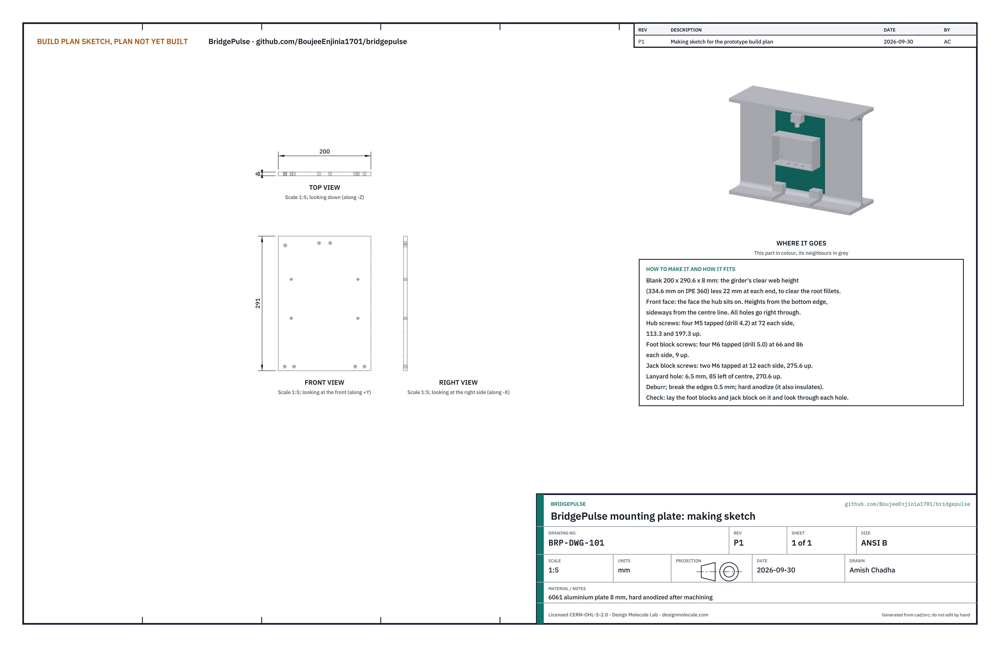

*Figure 2. Mounting plate making sketch (BRP-DWG-101).*

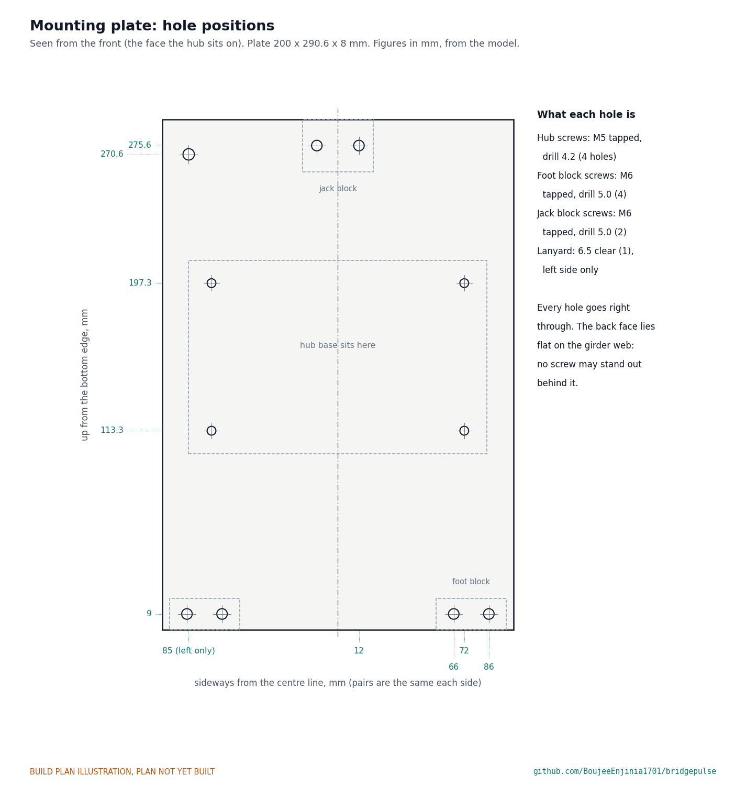

*Figure 3. Every hole, measured up from the bottom edge and sideways from the centre line, with the hub, foot blocks and jack block outlined.*

**What it is and what it is made from.** The plate everything at the girder hangs on: the hub on its front, the foot blocks at its bottom, the jack block at its top. Its back lies flat on the girder's web. Aluminium plate 8 mm thick, 6061 class, 200 wide; its length is the girder's clear web height (334.6 on an IPE 360) less 22 at each end, 290.6 on the example bridge.

**How to make it.**

1. Measure the clear height between the flanges of the girder it will go on, next to the web. Cut the blank 200 wide and that height less 44 long, square. File the edges and break them 0.5.
2. Scribe a centre line down the long side. Choose one face as the front and mark it.
3. Mark every hole from Figure 3: heights up from the bottom edge, sideways from the centre line.
4. Hub screws: four holes 72 each side of centre, 113.3 and 197.3 up. Drill 4.2 and tap M5 right through.
5. Foot block screws: four holes 66 and 86 each side of centre, 9 up. Drill 5.0 and tap M6 right through.
6. Jack block screws: two holes 12 each side of centre, 275.6 up. Drill 5.0 and tap M6 right through.
7. Lanyard hole: one 6.5 hole, 85 left of centre, 270.6 up.
8. Deburr every hole on both faces; the back must lie flat on the web, so take off every burr there.
9. Have the plate hard anodized. The anodizing protects it and insulates it from the steel.

**How it fits the parts next to it.** The back lies flat on the girder web, with 22 mm between each end and the flange, which clears the rounded root fillets (Figure 5). The foot blocks sit flat on the front at the bottom, the hub's base in the middle from 100.3 to 210.3 up, and the jack block at the top. No screw may stand out of the back.

**Check before moving on.** Lay the foot blocks and jack block on it and look through each hole: the holes line up without forcing a screw. Hold the plate against the web of the girder offcut: it fits between the fillets with no rock.

### 3.2 Foot blocks (make 2)

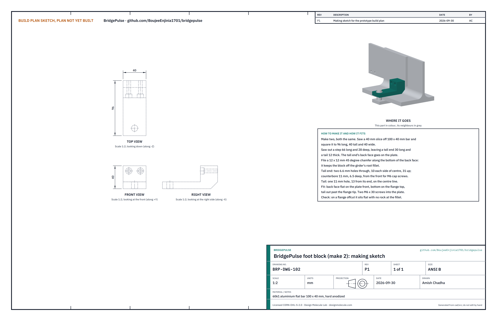

*Figure 4. Foot block making sketch (BRP-DWG-102).*

**What it is and what it is made from.** A stepped block that the plate stands on: its tall end is screwed to the plate, its tail lies on the bottom flange and is clamped at the flange edge. Aluminium flat bar 100 x 40, 6061 class.

**How to make it.**

1. Saw a 40 slice off the bar and square it to 96 long, 40 tall and 40 wide.
2. Saw out a step 66 long and 28 deep, leaving a tall end 30 long and a tail 12 thick. File the sawn faces flat. The outside face of the tall end is the back face; it goes on the plate.
3. File a 12 x 12 chamfer at 45° along the bottom edge of the back face. This keeps the block off the girder's root fillet.
4. Tall end: drill two 6.6 holes through, front to back, 10 each side of centre and 31 up from the bottom. Counterbore each 11 across and 6.5 deep from the front for an M6 cap screw.
5. Tail: drill one 11 hole, top to bottom, 13 from its end, on the centre line.
6. Deburr and have the blocks hard anodized with the plate.

**How it fits the parts next to it.**

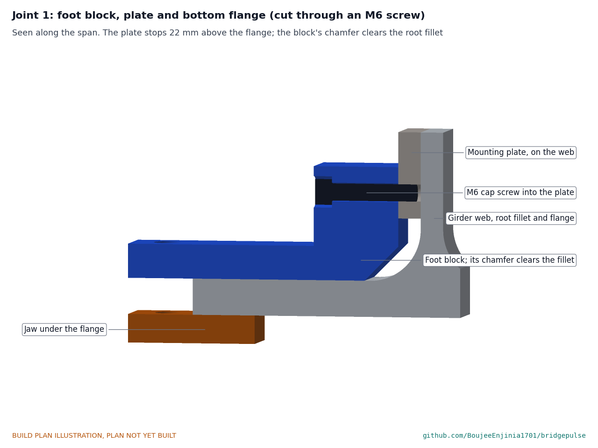

*Figure 5. Cut through an M6 screw: the plate stops 22 mm above the flange, and the block's chamfer clears the root fillet.*

The back face sits flat on the plate's front, its top 18 above the plate's bottom edge, and is held by two M6 x 30 cap screws into the plate's tapped holes; the screws end 1.5 short of the web. The block's bottom lies on the flange top and its tail runs 23 past the flange edge, where the clamp holds it (section 3.3).

**Check before moving on.** On the girder offcut, with the plate against the web, each block sits flat on the flange with no rock at the fillet.

### 3.3 Clamp jaws and packers (make 2 of each)

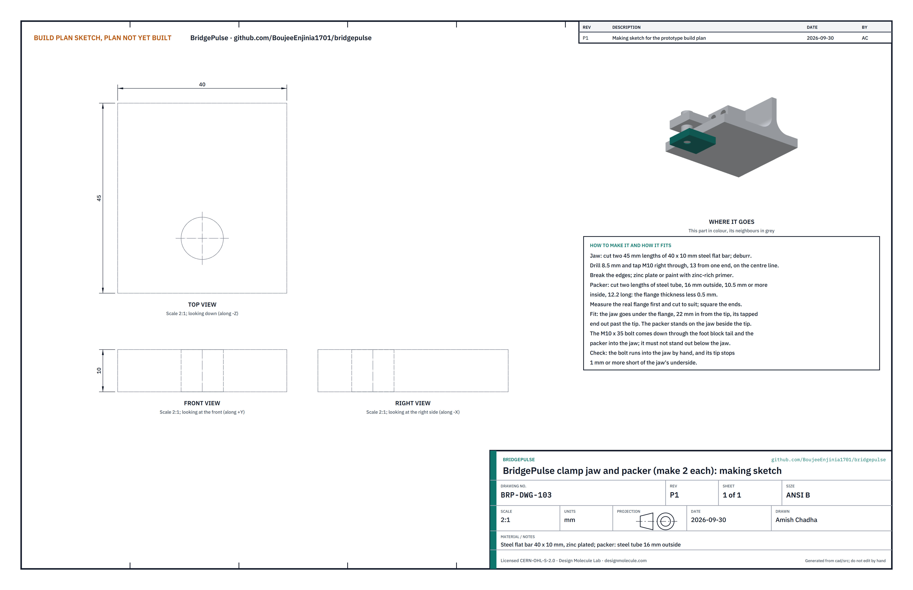

*Figure 6. Clamp jaw and packer making sketch (BRP-DWG-103).*

**What it is and what it is made from.** The jaw goes under the bottom flange and the packer stands beside the flange edge; one bolt pulls the jaw up and the foot block's tail down, gripping the flange between them. Jaw: steel flat bar 40 x 10, zinc plated. Packer: steel tube 16 outside, 10.5 or more inside.

**How to make it.**

1. Jaw: cut two 45 lengths of the flat bar. Drill 8.5 and tap M10 right through, 13 from one end, on the centre line. Break the edges and zinc plate them, or paint them with zinc-rich primer.
2. Packer: measure the real flange thickness at the flange edge (12.7 on an IPE 360). Cut two lengths of tube 0.5 shorter than that, 12.2 on the example. Square the ends.

**How it fits the parts next to it.**

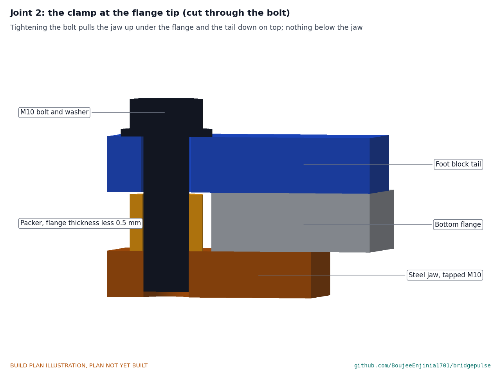

*Figure 7. Cut through the bolt: the jaw is under the flange, the packer stands on it outside the flange edge, and the bolt ends inside the jaw.*

The jaw lies under the flange, reaching 22 in from the edge, with its tapped end out past the edge. The packer stands on the jaw around the bolt, 2 clear of the flange edge. An M10 x 35 bolt with a washer comes down through the foot block's tail and the packer into the jaw. Because the packer is 0.5 shorter than the flange, tightening the bolt clamps the jaw to the flange's underside and the tail to its top. The bolt's end stops 1.2 short of the jaw's underside, so nothing but the 10 jaw is below the girder.

**Check before moving on.** The bolt runs into the jaw by hand, and with the jaw on a flat surface the bolt's end does not stand out below it.

### 3.4 Jack block

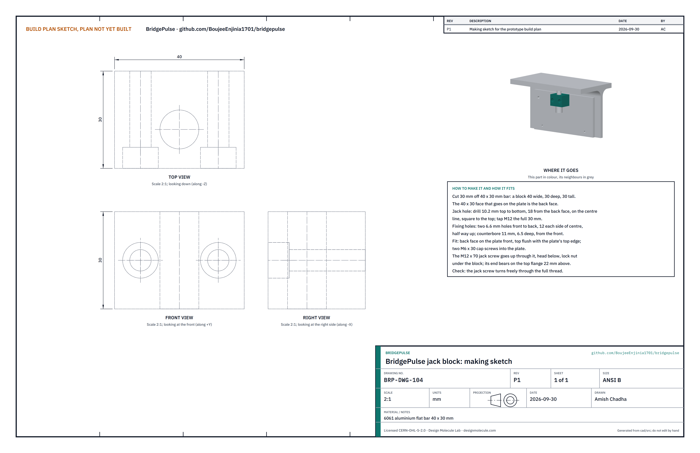

*Figure 8. Jack block making sketch (BRP-DWG-104).*

**What it is and what it is made from.** The block at the top of the plate that carries the jack screw. Aluminium flat bar 40 x 30, 6061 class.

**How to make it.**

1. Cut 30 off the bar: a block 40 wide, 30 deep and 30 tall. Choose a 40 x 30 face as the back face; it goes on the plate.
2. Jack hole: drill 10.2 top to bottom, 18 from the back face, on the centre line, square to the top. Tap M12 the full 30.
3. Fixing holes: two 6.6 holes front to back, 12 each side of centre and half way up. Counterbore each 11 across and 6.5 deep from the front.
4. Deburr.

**How it fits the parts next to it.**

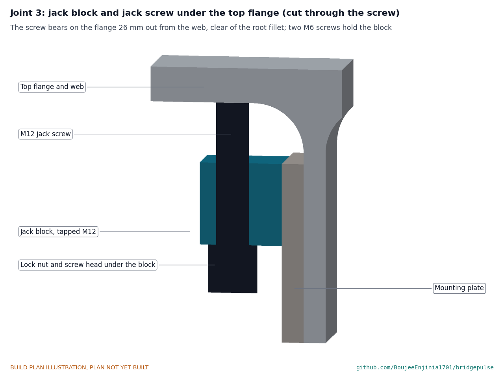

*Figure 9. Cut through the jack screw: it bears on the top flange 26 mm out from the web, clear of the root fillet.*

The back face sits on the plate's front with its top flush with the plate's top edge, held by two M6 x 30 cap screws. An M12 x 70 stainless screw goes up through it, head below, with a lock nut under the block. Its end bears on the underside of the top flange, 22 above the block. Winding it up wedges the plate between the flanges; the lock nut holds it there.

**Check before moving on.** The jack screw turns freely through the full thread and the lock nut runs down to the block.

### 3.5 Hub enclosure, drilled, with its glands and connector

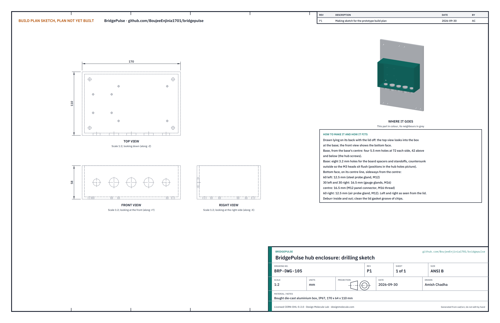

*Figure 10. Hub enclosure drilling sketch (BRP-DWG-105), drawn lying on its back.*

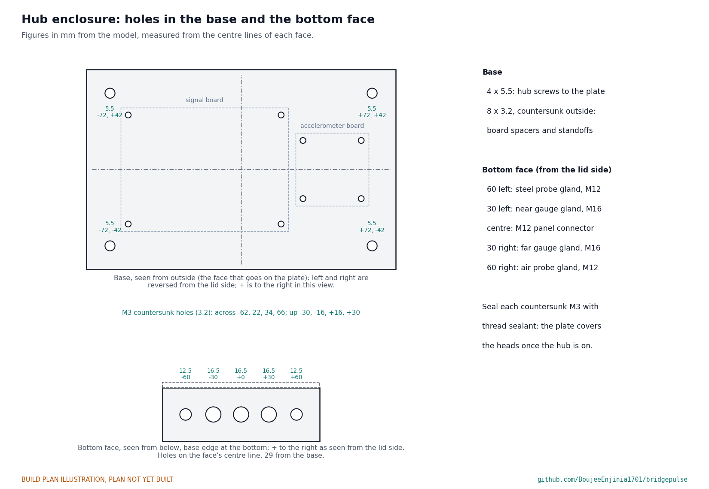

*Figure 11. Holes in the base, seen from outside, and in the bottom face, seen from below.*

**What it is and what it is made from.** A bought die-cast aluminium box, 170 wide, 64 deep and 110 tall, rated IP67, with a gasketed lid. Its base, the large face opposite the lid, is screwed flat to the plate; its bottom face takes the five penetrations.

**How to make it.**

1. Take the lid off and keep its screws. Lay the box on a soft cloth.
2. Base, from Figure 11: four 5.5 holes at 72 each side of the base's centre, 42 above and below it (the hub screws). Eight 3.2 holes for the board spacers and standoffs, countersunk from outside so M3 countersunk heads sit flush. Mind that Figure 11 shows the base from outside, so left and right are reversed.
3. Bottom face, on its centre line, 29 from the base: a 12.5 hole 60 left of centre (steel probe gland), 16.5 holes 30 left and 30 right (gauge glands), a 16.5 hole at the centre (panel connector) and a 12.5 hole 60 right (air probe gland). Pilot drill each 3, then open out with a step drill. Check each size against the part's datasheet before the last step.
4. Deburr inside and out and clean every chip out of the box and the lid's gasket groove.
5. Fit the five penetrations from below, seal outside and nut inside, to the maker's torque: M12 glands at 60 left and right, M16 glands at 30 left and right, the M12 5-pin panel connector in the centre.
6. Fit the eight board spacers and standoffs inside the base on M3 countersunk screws from outside, with a drop of thread sealant on each: four 5 metal spacers for the accelerometer board on the left, four 14 standoffs for the signal board to the right.

**How it fits the parts next to it.**

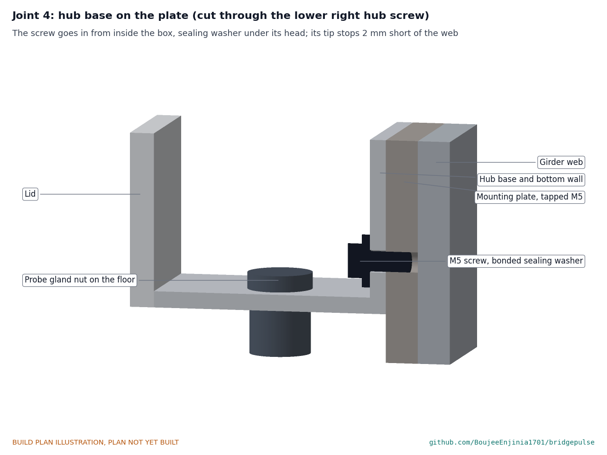

*Figure 12. Cut through a hub screw: it goes in from inside the box, with a bonded sealing washer under its head, and its tip stops 2 mm short of the web.*

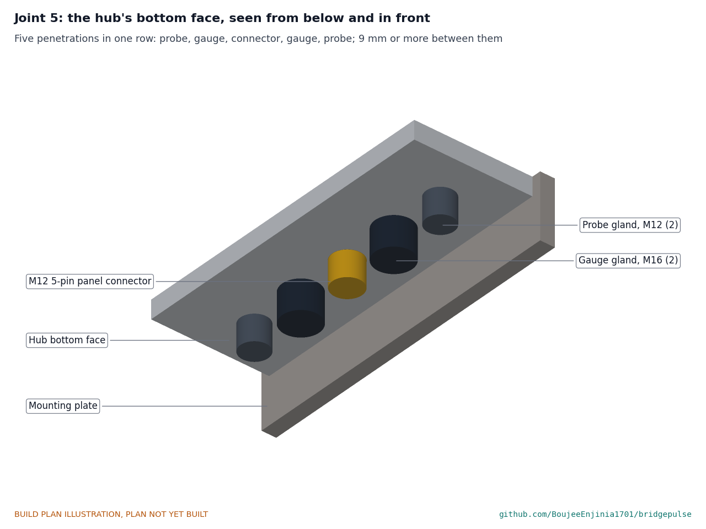

*Figure 13. The five penetrations, 9 mm or more apart.*

The base lies flat on the plate's front, centred, from 100.3 to 210.3 up the plate. Four M5 x 12 screws go from inside the box through the base into the plate, each with a bonded sealing washer under its head. Once the hub is on, the plate covers the countersunk M3 heads. The front face of the closed hub is 9 inside the line of the flange edge, so the hub sits inside the girder's outline.

**Check before moving on.** Every penetration seats evenly on its seal; the base sits flat on the plate with all four screw holes lined up; the lid closes on a clean gasket.

### 3.6 Boards in the hub

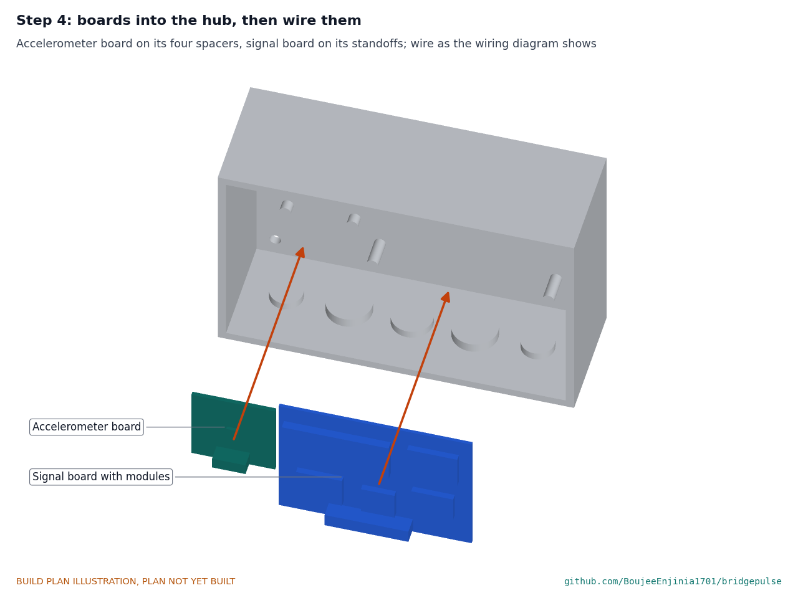

*Figure 14. The accelerometer board goes on the four short spacers on the left, the signal board on the four standoffs on the right.*

**What it is and what it is made from.** Bought modules: an ADXL355 class accelerometer board and a signal board made up of an RP2040 class controller board, a 24-bit bridge ADC module (ADS1220 class), a 5 V to 3.3 V buck converter, an RS-485 transceiver module, a microSD socket with a 32 GB card, the bridge completion resistors, an excitation switch and a terminal block, all on a 92 x 68 perforated carrier board.

**How to make it.**

1. Lay the modules out on the carrier board as Figure 14 shows: controller top left, ADC module top right, RS-485 module below it, buck converter lower left, microSD socket lower middle, terminal block along the bottom edge.
2. Drill the carrier's four 3.2 corner holes, 4 in from each edge, to match the standoffs.
3. Fit the modules on short M2.5 or M3 standoffs or solder them in, and wire them as Figure 15 shows (section 3.6.1).
4. Fit the accelerometer board on its four spacers and the carrier on its four standoffs, with M3 screws from inside.

#### 3.6.1 Wiring

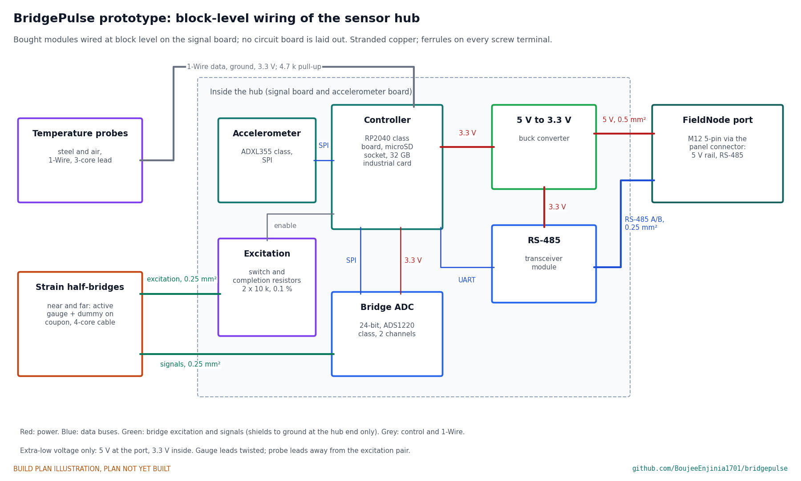

*Figure 15. Block-level wiring with wire sizes. No circuit board is laid out at this stage; bought modules stand in for it.*

Wire it like this, with stranded copper and a ferrule on every screw terminal:

1. Panel connector, switched 5 V rail and ground, to the buck converter's input: 0.5 mm² (20 AWG).
2. Buck converter's 3.3 V output to the controller, the ADC module, the RS-485 module and the accelerometer board: 0.5 mm².
3. Panel connector's two RS-485 pins to the RS-485 module's A and B: 0.25 mm² (24 AWG), twisted. The pin assignment follows the FieldNode candidate pinout, which is still being agreed (design decisions register).
4. Controller to the RS-485 module (UART), to the ADC module and to the accelerometer board (SPI): short 0.25 mm² leads.
5. Controller output to the excitation switch's enable input: 0.25 mm².
6. Each gauge cable at the terminal block: excitation pair from the excitation switch, signal pair to the ADC module through the completion resistors, shield to ground at the hub end only.
7. Both probe leads at the terminal block on one 1-Wire bus: data to a controller pin with a 4.7 k pull-up to 3.3 V, ground and 3.3 V.

**Check before moving on.** Every wire continues end to end; with nothing connected, the 5 V and 3.3 V rails read open to ground; every wire is labelled.

### 3.7 Dummy gauge coupons (make 2)

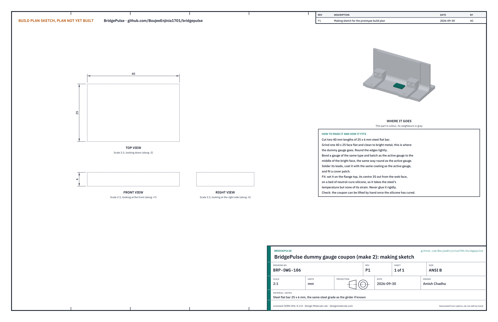

*Figure 16. Dummy gauge coupon making sketch (BRP-DWG-106).*

**What it is and what it is made from.** A small loose piece of steel carrying a second gauge that sees the girder's temperature but none of its strain, so the half-bridge cancels temperature. Steel flat bar 25 x 6, the same grade as the girder if known.

**How to make it.**

1. Cut two 40 lengths of the flat bar. Round the edges lightly.
2. Grind one 40 x 25 face flat and clean it to bright metal.
3. Bond a gauge of the same type and batch as the active gauge to the middle of that face, the same way round, following the gauge maker's procedure.
4. Solder its leads, coat it with the same coating as the active gauge and fit a cover patch.

**How it fits the parts next to it.**

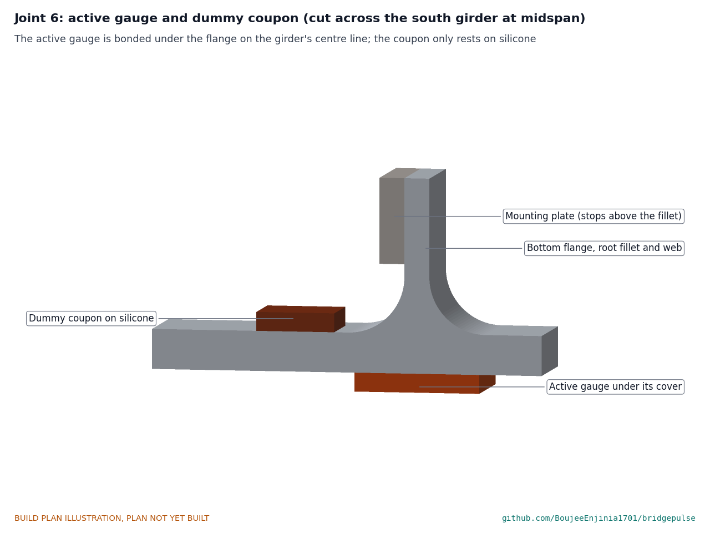

*Figure 17. Cut across the south girder at midspan: the active gauge under the flange, the coupon on the flange top.*

The coupon lies on the top of the bottom flange, its centre 35 out from the web face (clear of the root fillet), on a bed of neutral-cure silicone that holds it in place without passing strain into it. Never glue it rigidly.

**Check before moving on.** Once the silicone has cured, the coupon can be lifted by hand.

### 3.8 Temperature probes (make 2)

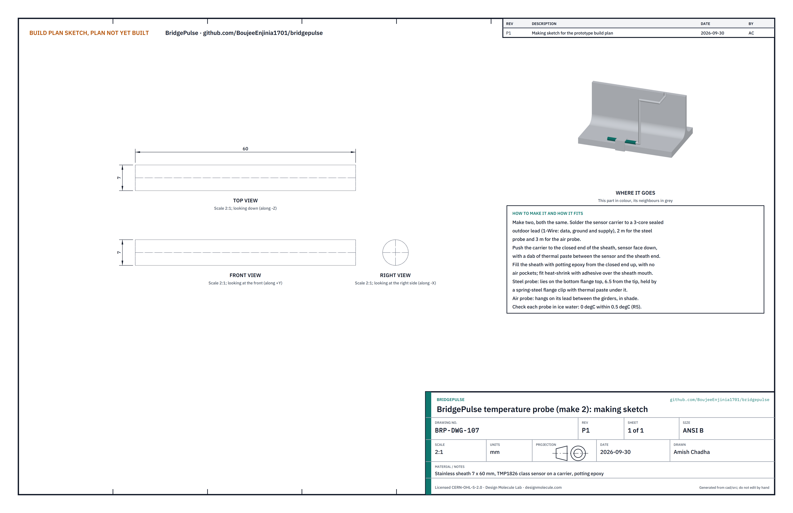

*Figure 18. Temperature probe making sketch (BRP-DWG-107).*

**What it is and what it is made from.** A TMP1826 class digital temperature sensor on a small carrier, potted in a stainless sheath 7 across and 60 long, with a sealed outdoor lead. One measures the steel, one the shaded air.

**How to make it.**

1. Solder the sensor carrier to a 3-core sealed outdoor lead: about 2 m for the steel probe and 3 m for the air probe.
2. Push the carrier to the closed end of the sheath, sensor face down, with a dab of thermal paste between the sensor and the sheath.
3. Fill the sheath with potting epoxy from the closed end up, with no air pockets. When it has cured, fit adhesive-lined heat-shrink over the sheath's mouth and the lead.

**How it fits the parts next to it.**

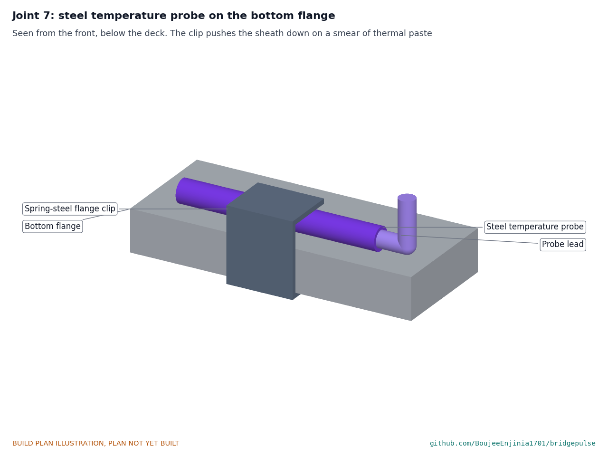

*Figure 19. The steel probe lies on the bottom flange, 6.5 mm in from its edge, under a push-on flange clip.*

The steel probe lies along the top of the bottom flange, 140 left of centre and 6.5 in from the flange edge, on a smear of thermal paste, held down by a spring-steel flange clip pushed onto the flange edge. Its lead runs up to the hub's left probe gland. The air probe hangs on its lead in the shade between the girders (step 13).

**Check before moving on.** Put both probes in a bath of crushed ice and water with a reference thermometer: each reads 0 °C within 0.5 °C (R5).

### 3.9 Cables, clips and the M12 cable (bought)

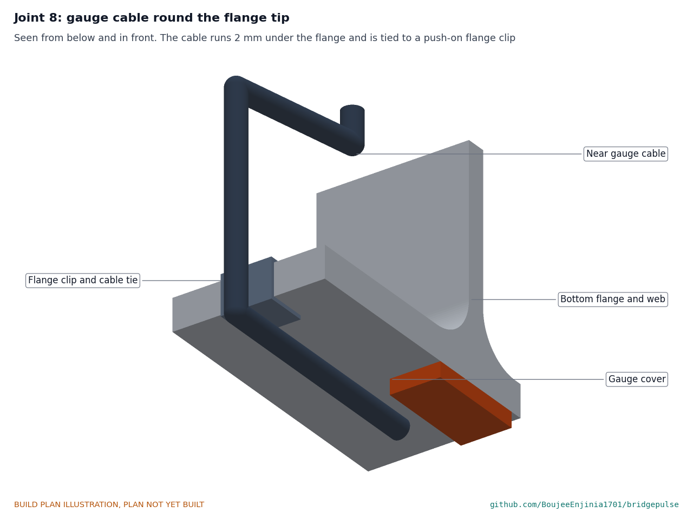

*Figure 20. The near gauge cable leaves the gauge cover, runs 2 mm under the flange and round its edge, tied to a push-on flange clip.*

**What it is.** Two shielded 4-core outdoor gauge cables, one moulded M12 5-pin cable about 2 m long from the hub's panel connector to the FieldNode port, five push-on spring-steel flange clips for 10 to 16 flanges (one of them holds the steel probe) and UV-stable cable ties. Nothing is drilled.

**How it fits.** Each gauge cable leaves its gauge cover, runs under the bottom flange clipped 2 below it, turns round the flange edge on a flange clip, rises beside the edge and goes into its gland from below: the near cable into the left gauge gland and the far cable into the right one. The far cable crosses between the girders under the deck, 3 inboard of each flange edge. The M12 cable leaves the panel connector, runs out past the flange edge, rises beside the post and plugs into the FieldNode's port B.

### 3.10 FieldNode core (built to its own plan)

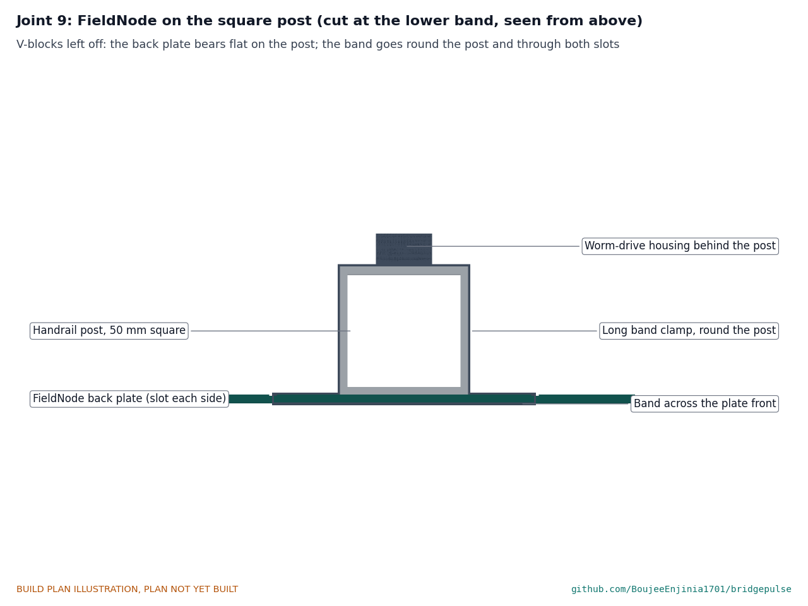

*Figure 21. Cut at the lower band, seen from above: the back plate flat on the post, the band round the post and through both slots.*

**What it is.** The lab's shared power and radio node: a sealed box with a cell, charger, LoRaWAN radio and two M12 sensor ports, a 6 W solar panel on a bracket above it, and a back plate with band clamps. Build it to its own plan, FND-BLD-001, with two differences for a square handrail post:

1. Leave the two V-blocks off. Their screw holes in the back plate stay empty.
2. Buy its two band clamps one size longer, with a band of about 300 to 330 mm, since each band goes round the 50 mm post, through both slots in the back plate and across its front.

**How it fits.** The back plate bears flat on the post's outer face, with the box base 450 above the deck. Each band goes round the post, along the back of the plate to a slot, through it, across the plate's front and back through the other slot; its worm-drive housing sits behind the post.

**Check before moving on.** Each band closes on the post with adjustment to spare, and the node does not turn on the post when pushed by hand.

### 3.11 Bought components

Buy to specification, not brand. Line numbers are those of the bill of materials.

- **Hub enclosure (line 1).** Die-cast aluminium box, IP67, 170 x 64 x 110 outside, gasketed lid; two M16 x 1.5 nylon glands for 4 to 8 cable and two M12 x 1.5 glands for 3 to 6.5 cable, each IP68.
- **Accelerometer board (line 2).** ADXL355 class, 22.5 µg/√Hz, SPI, on a breakout with four mounting holes; four 5 metal spacers.
- **Signal board (line 3).** As section 3.6; four 14 standoffs; bridge completion resistors 10 k, 0.1 %.
- **Mounting fixings (line 4).** Stainless: one M12 x 70 hex screw and one M12 nut; two M10 x 35 hex bolts and washers; six M6 x 30 cap screws; four M5 x 12 screws with bonded sealing washers; nylon isolating washers; a 3 mm stainless lanyard.
- **Strain gauges (line 5).** Four 350 Ω foil gauges self-temperature-compensated for steel, from one batch; cyanoacrylate gauge adhesive; surface preparation kit; gauge coating and four cover patches about 60 x 40; neutral-cure silicone.
- **Temperature probes (line 6).** Two TMP1826 class sensors on carriers, two stainless sheaths 7 x 60, sealed 3-core lead, potting epoxy, adhesive-lined heat-shrink.
- **Cables and clips (line 7).** As section 3.9, and the M12 5-pin panel connector (rear mounting, M16 thread).
- **FieldNode core (line 8).** As section 3.10.
- **microSD card (line 9).** 32 GB, rated -25 to +85 °C.
- **Bench rig (not in the bill of materials).** Two offcuts of the girder section about 450 long (IPE 360 on the example bridge), set up on the bench 1.2 m apart, centre to centre; a 1.5 m stub of 50 x 50 x 3 square hollow section held upright in a stand.

## 4. Putting it together

In each picture the parts already fitted are grey and the part being fitted is in colour, with an arrow showing the way it goes in.

### Step 1: foot blocks onto the plate

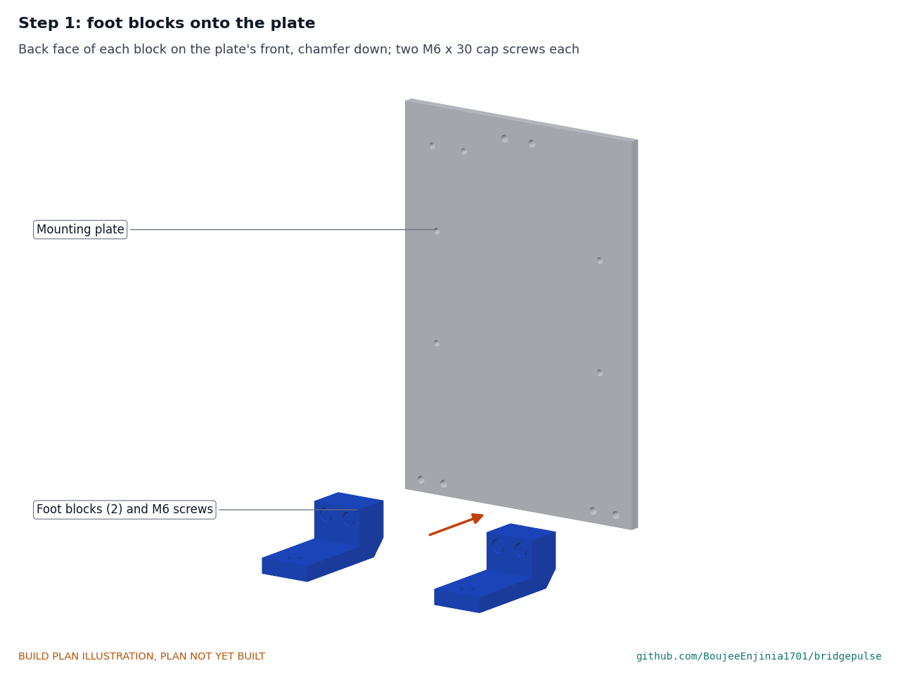

Lay the plate front up. Put each foot block's back face on the plate's front at the bottom, chamfer down, and fit two M6 x 30 cap screws, tight.

### Step 2: jack block and jack screw onto the plate

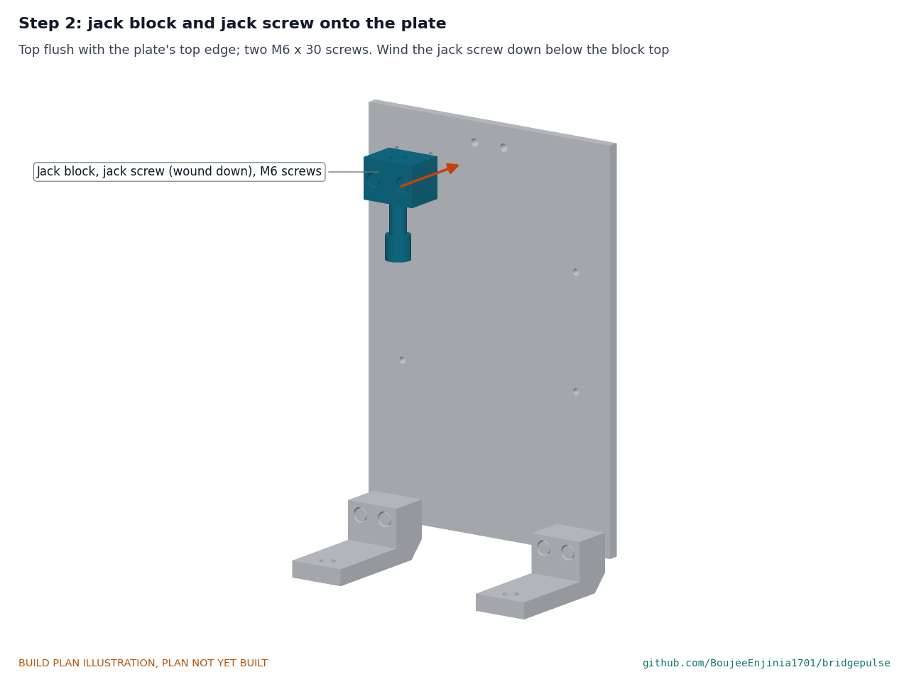

Fit the jack block at the top of the plate's front, its top flush with the plate's top edge, with two M6 x 30 cap screws. Run the lock nut onto the M12 screw, then screw it up into the block from below until its end is just below the block's top.

### Step 3: glands, connector, spacers and standoffs into the hub

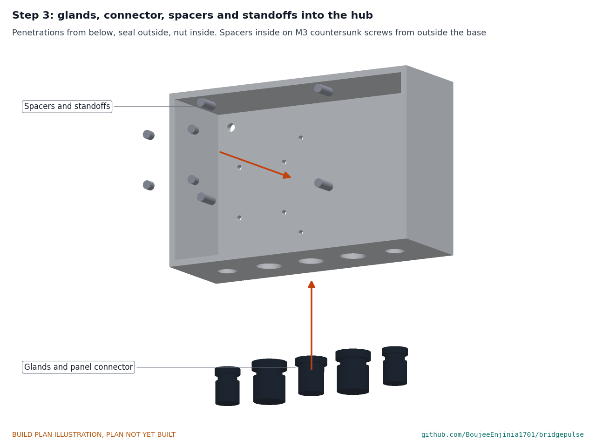

As section 3.5, steps 5 and 6. Fit blanking plugs in any gland whose cable is not yet ready.

### Step 4: boards into the hub, then wire them

Fit the accelerometer board and the signal board, and wire them as Figure 15. **Hold point:** the wiring checks of section 3.6 pass.

### Step 5: plate onto the girder

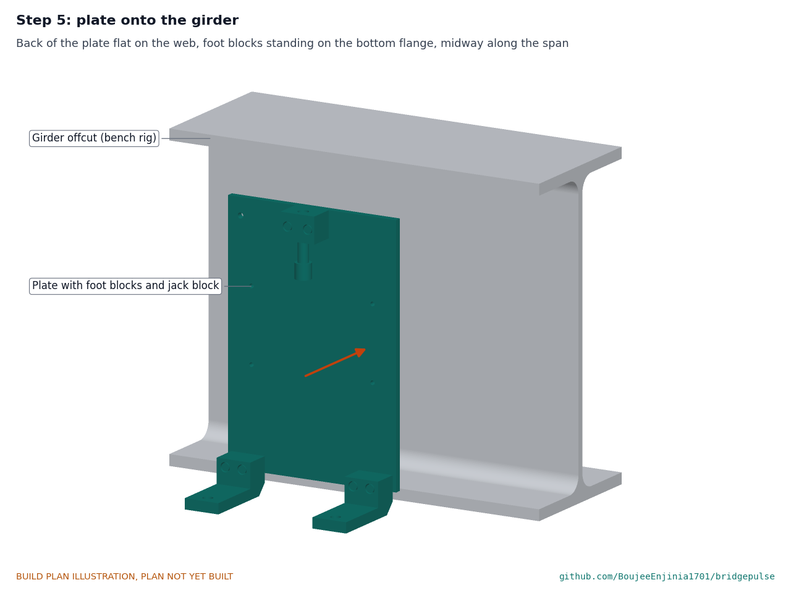

Hold the plate with its back flat on the outer face of the south girder's web, its foot blocks standing on the bottom flange, midway along the offcut.

### Step 6: clamp the foot blocks to the flange

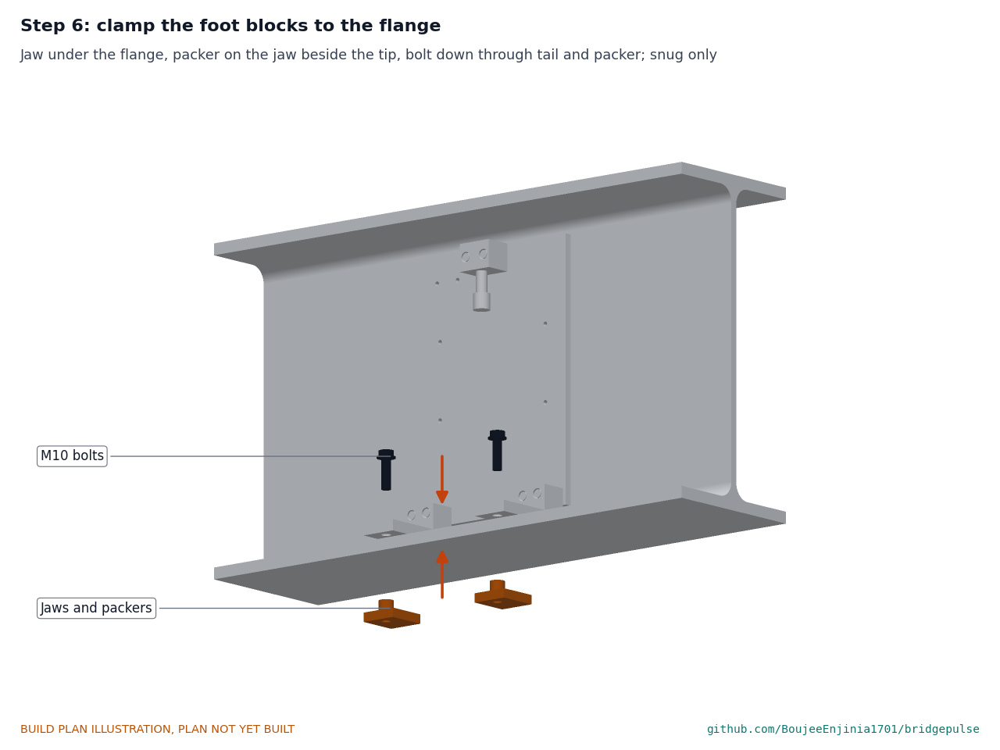

For each block, slide a jaw under the flange with its tapped end out past the flange edge, stand a packer on the jaw beside the edge, and fit an M10 x 35 bolt and washer down through the tail and the packer into the jaw. Snug only.

### Step 7: jack screw up to the top flange

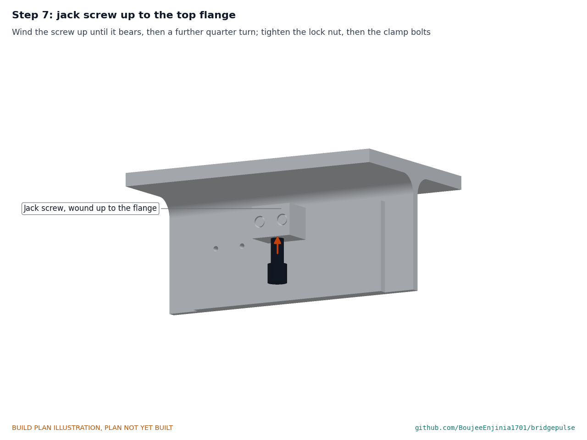

Wind the jack screw up until its end bears on the top flange, then a further quarter turn. Tighten the lock nut. Then tighten both clamp bolts to the torque the bolt maker gives for their grade, and record it.

### Step 8: hub onto the plate

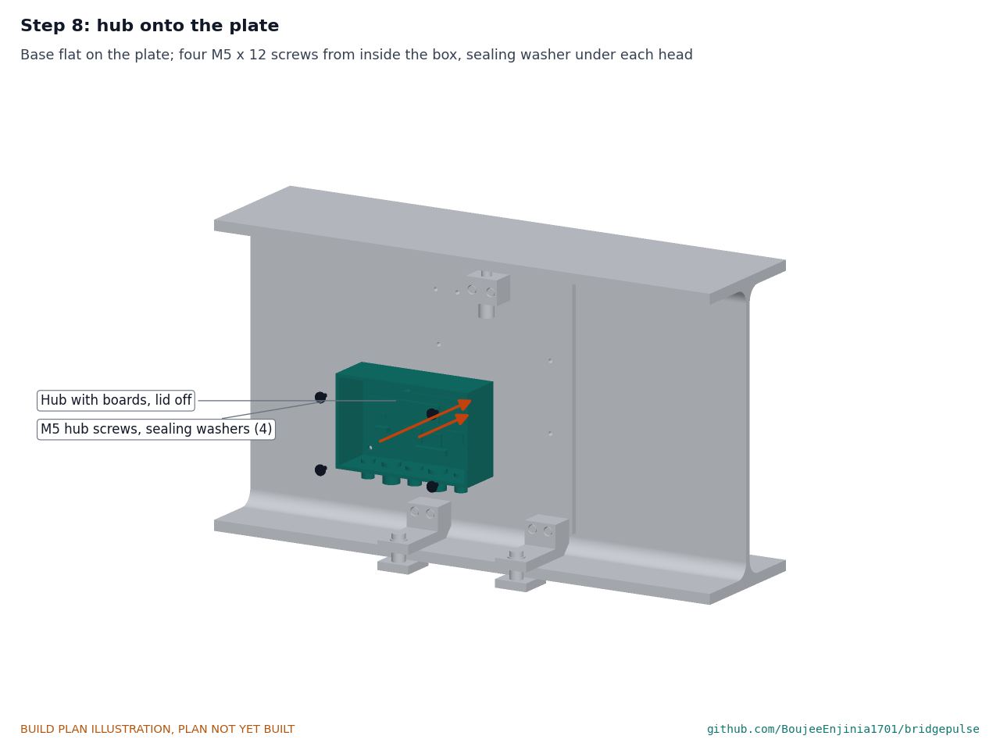

With the lid off, hold the hub's base flat on the plate, centred, and fit the four M5 x 12 screws from inside the box, a bonded sealing washer under each head. Tighten evenly.

### Step 9: strain gauge and dummy coupon

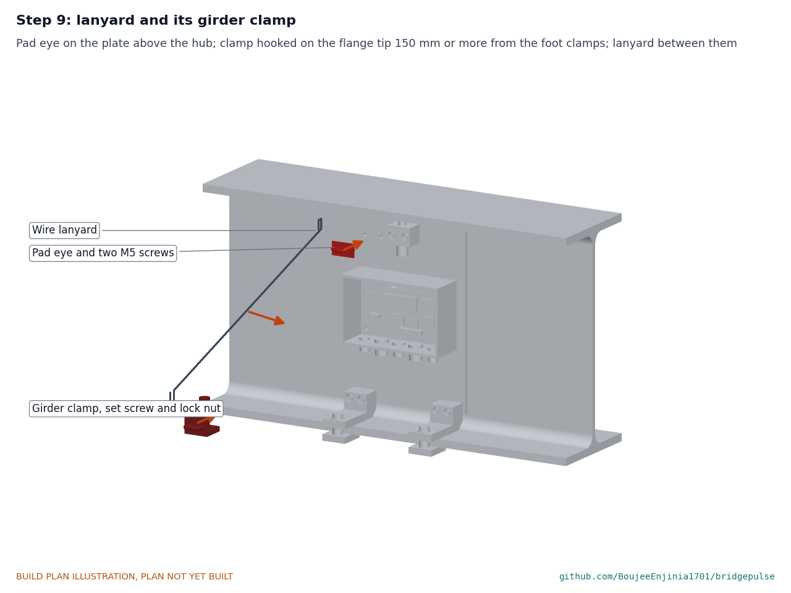

On each girder offcut: prepare a patch of bare steel under the bottom flange on the girder's centre line, bond the active gauge along the girder, solder its leads, coat it and fit its cover. Set the dummy coupon on silicone on the flange top as section 3.7. On a real bridge, paint is removed only with the owner's permission and after a lead test (section 6, S4).

### Step 10: steel probe, cables and clips

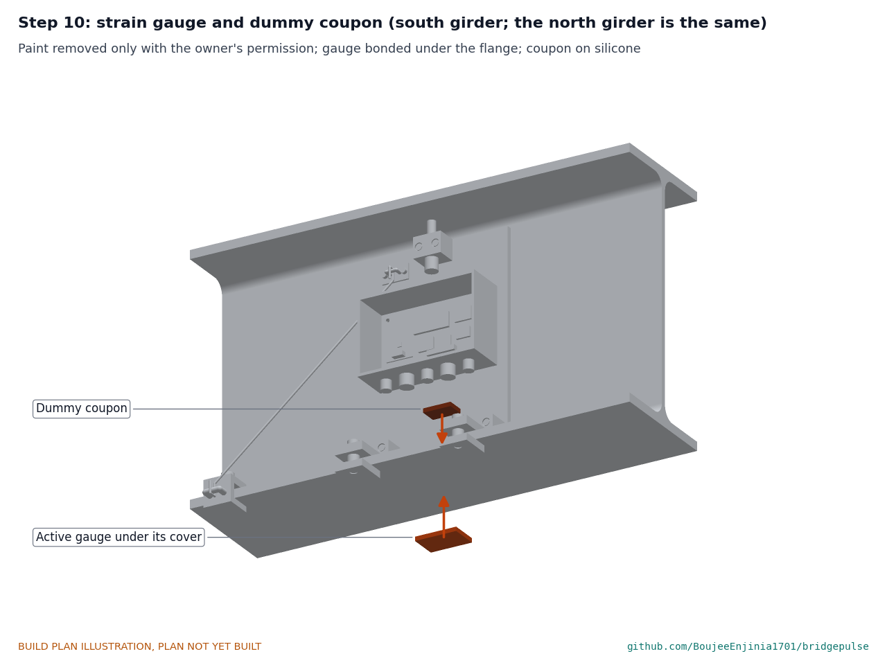

Push the probe clip onto the flange edge over the steel probe, with thermal paste under the probe. Push the cable clips onto the flange edges, run the near gauge cable and the steel probe lead to their glands, tie them to the clips, and tighten the glands on them. Connect them at the terminal block.

### Step 11: close the lid

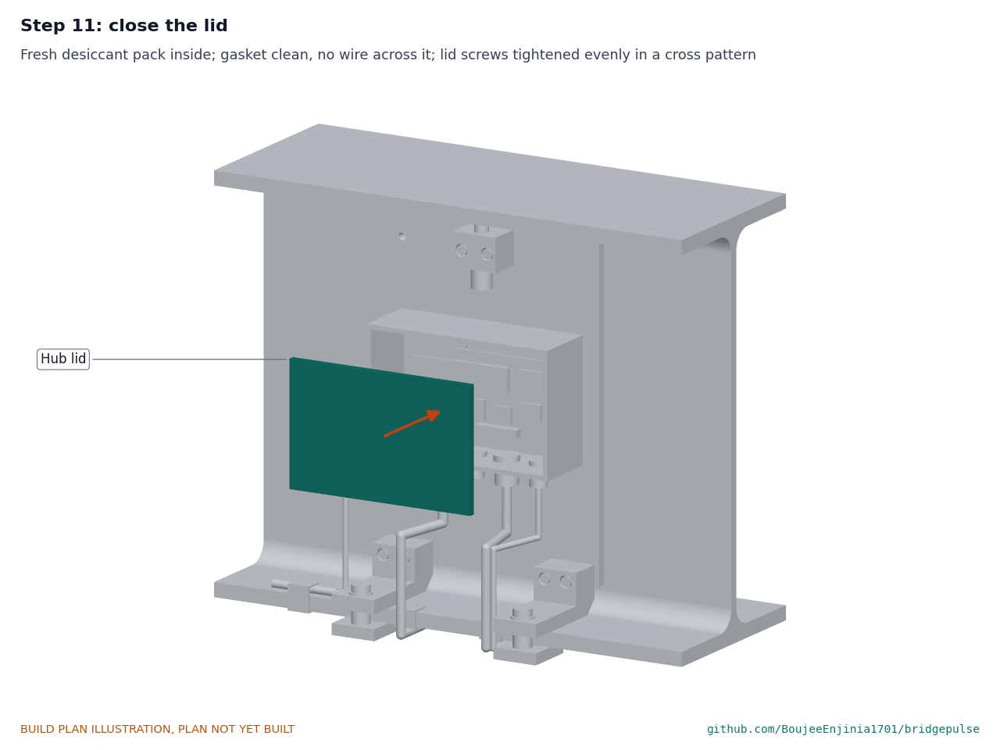

Put a fresh desiccant pack in the hub. Check the gasket is clean and seated with no wire across it, and tighten the lid screws evenly in a cross pattern.

### Step 12: FieldNode core onto the post

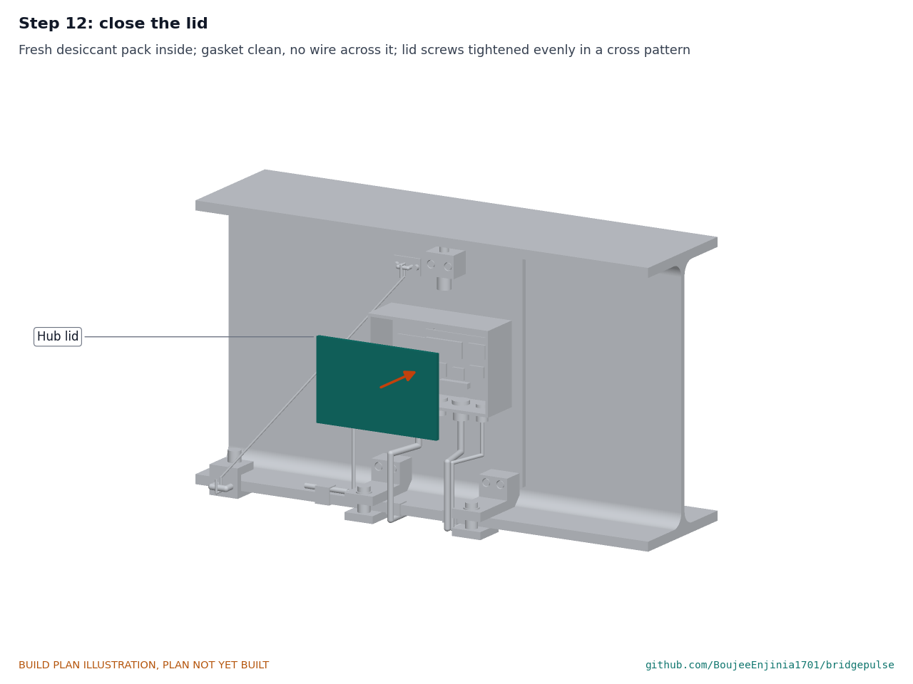

Hold the FieldNode's back plate flat on the post's outer face, its box base 450 above the deck level. Pass each band round the post, through both slots and across the plate's front, worm-drive housing behind the post, and tighten. **Hold point:** the FieldNode core has passed its own plan's safety stops before its cell is fitted.

### Step 13: cable to the FieldNode, far gauge cable and air probe

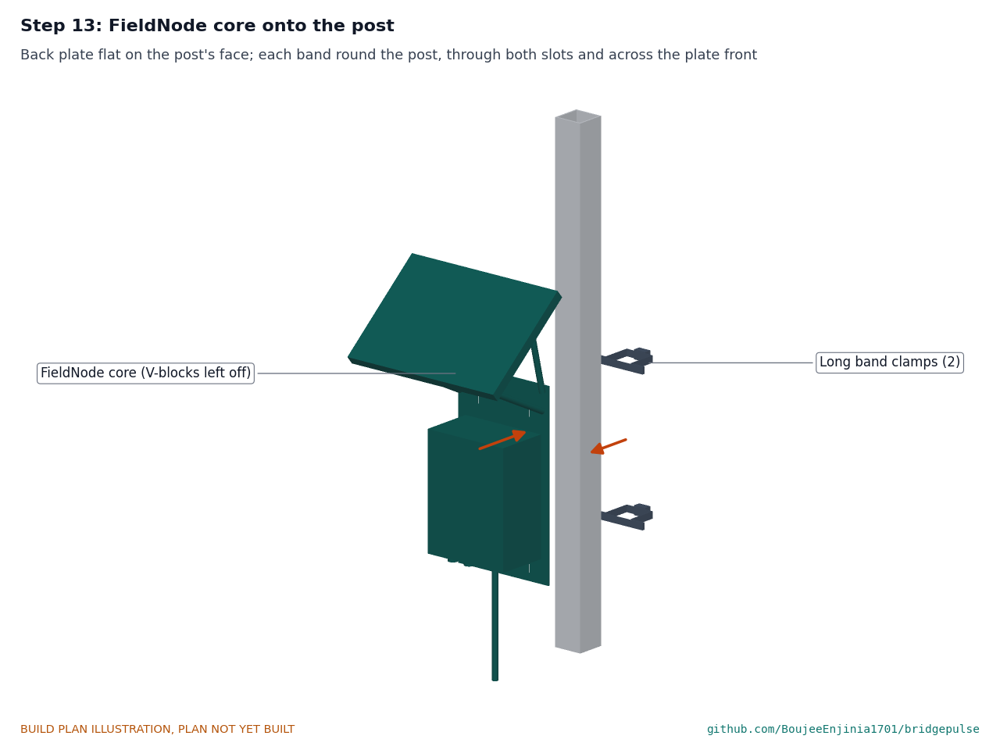

Plug the M12 cable into the hub's panel connector, run it out past the flange edge and up beside the post, clipped to it, and into the FieldNode's port B. Run the far gauge cable from the second girder's gauge under its flange, across between the girders and under the south flange to the right gauge gland. Hang the air probe on its lead from the far cable's crossing, about 110 below it, tie its lead along the far cable to the right probe gland, and tighten both glands. On the bench, tie the crossing to the bench frame.

## 5. First checks

These are the checks a TRL 4 test report would record; this plan only lists them. Requirement numbers are those of BRP-REQ-001.

*Table 2. First checks.*

| Check | Requirement | How | Pass when |
| --- | --- | --- | --- |
| Penetrations and lid sealed | R10 | Look at each seal under a lamp; gland caps tight on their cables | Every seal evenly squeezed; no gap at the lid gasket |
| Mount is firm | R1, R2 | Push the hub by hand in every direction; tap the hub with a soft mallet while recording the accelerometer | Nothing moves at any joint; the hub's own mode in the record is above 120 Hz |
| Accelerometer noise | R1 | Record 10 minutes on a quiet bench at night | Noise density 25 µg/√Hz or less in the 0.5 to 60 Hz band |
| Strain channels | R4 | Read both channels at rest, then put a known shunt resistor across each active gauge | Steady readings; the shunt step matches its calculated strain within 2 µε |
| Temperature probes | R5 | Ice-point check (section 3.8), then both probes beside a reference in still air | 0 °C within 0.5 °C; within 0.5 °C of the reference |
| Power at the port | R6 | Bench supply at 5 V with a 200 mA limit in place of the FieldNode port; measure current through a 10 minute record | About 19 mA while recording (93 mW); 0 when the rail is off |
| Summary and storage | R7 | Run one record; read the summary bytes on the RS-485 link and the raw file on the card | 36 bytes, or 11 in reduced mode; raw file about 1.9 MB |
| No drilling, fitting time | R8 | Time the plate, hub and clamps going on the offcut | Nothing drilled into the steel; time recorded |
| Depth below the girder | R9 | Straight edge across the underside of the bottom flange; measure the jaws, covers, clips and cables | 15 mm or less everywhere (10 mm by the model) |
| Hub inside the girder outline | R9 | Straight edge down from the flange edge | The closed hub's front face is inside the edge line |

## 6. Safety stops

Stop at each point. Carry on only when everything listed is true.

- **S1. Before the girder offcuts are moved.** Two people to lift each; the offcuts stand on their bottom flanges on a firm floor or low trestles that cannot tip; feet and hands clear.
- **S2. Before any steel from a bridge is ground or sanded.** A lead test of its paint is negative, or the paint is removed by a trained contractor under local abatement rules.
- **S3. Before gauge adhesive, conditioner or potting epoxy is opened.** Safety data sheets read; gloves and eye protection on; the room ventilated; no food nearby.
- **S4. Before paint is removed from a real bridge.** The owner's written permission is in hand, and the lead test of S2 is done on that bridge.
- **S5. Before the hub is first powered.** The bench supply is set to 5 V with a 200 mA current limit; the panel connector's pin assignment is checked against the wiring with a meter, not by wire colour.
- **S6. Before the FieldNode core's cell is fitted.** Its own plan's safety stops are passed (FND-BLD-001).
- **S7. Before the rig is left unattended.** The jack lock nut and both clamp bolts are tight and their torques recorded; no cable is under strain.
- **S8. Before any installation on a bridge (outside this plan).** The owner's written permission; a trained crew of at least two; fall protection and a rescue plan for work over water; traffic management where needed; the lanyard fitted to its anchor; tamper-resistant fixings on the FieldNode. Never work alone.

## 7. Tools, skills and workspace

**Tools.** Hacksaw with a 24 teeth per inch blade, or a bandsaw; bench vice with soft jaws; bench drill or a drill in a stand; drills 3 to 12; step drill to 20; 11 counterbore (or an 11 flat-bottomed drill); countersink; taps M5, M6, M10 and M12 with their tap drills (4.2, 5.0, 8.5, 10.2); flat and half-round files; deburring tool; scriber, engineer's square, 45° square, steel rule and calipers; torque wrench covering about 5 to 40 N·m; spanners and hex keys; soldering iron; ferrule crimper and wire strippers; multimeter; bench power supply with an adjustable current limit; strain gauge installation kit; heat gun; ice bath and a reference thermometer; lead paint test kit; stopwatch.

**Skills.** No certified trade is needed. Basic metalwork (marking out, sawing, drilling, tapping, filing), through-hole soldering and crimping, and strain gauge bonding, which is best practised first on a scrap of steel. All circuits are extra-low voltage: 5 V at the port and 3.3 V inside the hub. The bench supply must be a certified, undamaged unit; no mains wiring is part of this build.

**Workspace.** A bench about 1.5 x 0.6 m with room beside it for the two girder offcuts 1.2 m apart; a metalwork corner kept apart from the electronics; a clean, dust-free, ventilated place for bonding gauges and potting probes.

**Personal protective equipment.** Safety glasses for cutting, drilling, soldering and chemicals; nitrile gloves for adhesives and epoxy; cut-resistant gloves for bar and plate; safety boots for the offcuts; hearing protection when sawing; no gloves near a turning drill.

## 8. Where the numbers come from

- Model and constructability checks: `cad/src/model.py` (`python cad/src/model.py --check`, 75 checks); STEP and STL exports in `cad/step/` and `cad/stl/`.
- Pictures: `cad/src/build_plan_media.py`, using `.kit/build_views.py`; written to `docs/05-build-plan/` and `cad/drawings/BRP-DWG-101` to `BRP-DWG-107`.
- General arrangement: `cad/drawings/BRP-DWG-001.pdf`, Rev P5.
- Calculations: `docs/04-calcs/01-sizing.md` (BRP-CAL-001 v0.3) and `docs/04-calcs/sizing.py`; mass [H1], mount stiffness [H2], retention [H4], root fillets [H4b], depth below the girder [H5], FieldNode on the post [H7], [H8], power [F2], [F3], cost [K1].
- Bill of materials: `bom/bom.csv` and `bom/bom-notes.md`.
- Decisions: `docs/decisions/0004-design-for-construction.md` (BRP-DDR-004), with BRP-DDR-001 to BRP-DDR-003; open items in `docs/06-design-decisions.md` (BRP-DEC-001).
- Requirements: `docs/03-requirements.md` (BRP-REQ-001 v0.5).
- FieldNode core: FieldNode's build plan FND-BLD-001, in the FieldNode repository.
